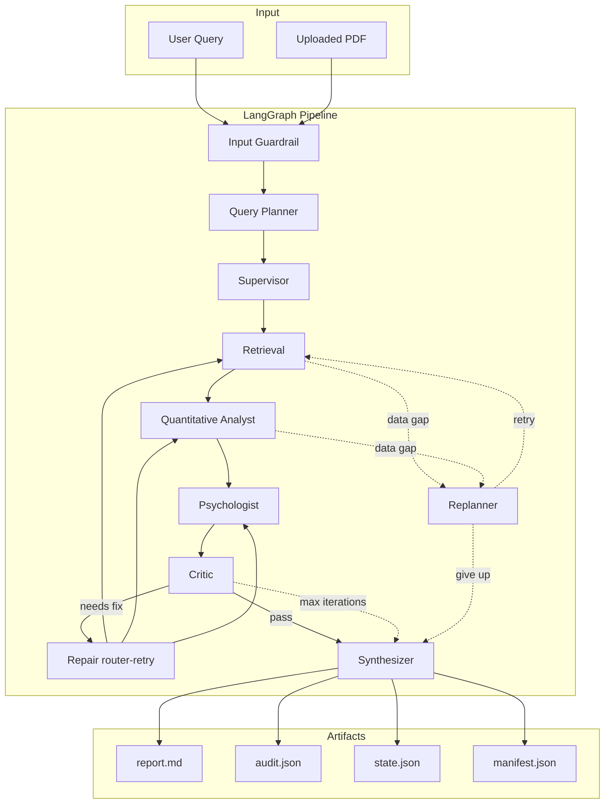

# LumenFin Agent

> Evidence-grounded multi-agent financial diligence workbench (not a chat wrapper).

Traceable LangGraph workflow | Hybrid Milvus RAG | AST-safe metrics | Offline test harness

[Chinese overview](docs/README_zh.md) | [Quick Start](#quick-start) | [Architecture decisions](docs/architecture_decisions.md)

---

## What it is

LumenFin turns **user queries and uploaded financial PDFs** into a **structured diligence report** through an explicit LangGraph pipeline:

- Each step is logged to `audit_log` and exported as JSON artifacts.
- Numeric ratios are computed by an **AST-safe expression engine**, not by the LLM.
- PDF evidence is retrieved via **Milvus Lite hybrid RAG** (vector + keyword + RRF) with page citations.
- Missing data triggers **replanner / degraded mode** instead of silent hallucination.

---

## Positioning (vs. a RAG chatbot)

| Dimension | Typical RAG chatbot | LumenFin |
|-----------|---------------------|--------------|
| Orchestration | Single prompt / ReAct loop | LangGraph explicit state machine |
| Numbers | Model narration | `quant` node AST evaluation |
| Evidence | Optional citations | Hybrid RAG + `rag_evidence` + page cites |
| Quality | Subjective reading | Golden eval / RAG metrics / trace scorer |
| Failure | Hallucinate or crash | Replanner -> degraded mode |

---

## Architecture



**Repair note:** `repair` is an **evaluator-router-retry prototype** (routes back to retrieval/quant/sentiment based on critic findings). It is not yet a full LLM-based repair policy that rewrites queries or patches data.

**Retrieval detail:** PDF -> page chunks -> Milvus Lite -> vector + keyword -> RRF -> `filename#p{page}` citations.

---

## Quick Start

### 0. Encoding (Windows)

PowerShell on Windows may use a legacy code page; run UTF-8 setup before running the app:

```powershell
cd lumenfin-agent
. .\scripts\ensure_utf8.ps1
```

Or use VS Code task: **Tasks -> Run Task -> Run Demo (UTF-8)**.

All repository text files are UTF-8 (see `.gitattributes`, `.editorconfig`, [docs/ENCODING.md](docs/ENCODING.md)).

### 1. Install (once)

```powershell
cd lumenfin-agent
.\.venv\Scripts\pip install -e .
.\.venv\Scripts\python -c "import lumenfin; print('OK')"
```

### 2. Configure LLM

```powershell
copy .env.example .env
# Edit .env - set DEEPSEEK_API_KEY=sk-...
```

Without a key, the system uses `local-fallback` (good for wiring tests; weaker reports).

### 3. CLI demo

```powershell
. .\scripts\ensure_utf8.ps1
.\.venv\Scripts\python run_demo.py --thread-id learning-001
```

Outputs under `outputs/`:

```text
learning-001_*_report.md
learning-001_*_audit.json
learning-001_*_state.json
learning-001_*_manifest.json
```

### 4. Web UI + PDF upload

```powershell
. .\scripts\ensure_utf8.ps1
.\.venv\Scripts\python start_api.py
```

| URL | Purpose |
|-----|---------|
| http://127.0.0.1:8000 | Web UI |
| http://127.0.0.1:8000/docs | OpenAPI |

HITL: ambiguous queries may return `workflow_status: needs_clarification`; resume with `POST /api/v1/clarify`. State is persisted in **SQLite** (`workflow_checkpoints`) so API restart can resume. See [docs/HITL_CLARIFICATION.md](docs/HITL_CLARIFICATION.md).

Structured metrics (no PDF): `POST /api/v1/analyze-data` with a `company_metrics` object keyed by company name.

```json
{
  "query": "Compare FY2025 margins",
  "company_metrics": {
    "NVIDIA": { "revenue_2025": 130.5, "ebitda_2025": 75.2 }
  }
}
```

### 5. Tests and eval

Offline tests (mock LLM + fake market data, no external API):

```powershell
.\.venv\Scripts\python scripts\run_tests.py
```

Optional live integration test (requires DeepSeek key in `.env`):

```powershell
$env:RUN_INTEGRATION_TESTS = "1"
.\.venv\Scripts\python scripts\run_tests.py --integration
```

Eval scripts:

```powershell
.\.venv\Scripts\python scripts\run_golden_eval.py --write
.\.venv\Scripts\python scripts\run_rag_eval.py
```

---

## Capabilities

| Area | What is implemented |
|------|---------------------|
| Orchestration | LangGraph `StateGraph`, conditional edges, SQLite HITL checkpoint |
| Hybrid RAG | Milvus Lite + keyword + RRF; page-level citations in state |
| Deterministic quant | AST-safe formulas for margins, intensity, derived ratios |
| Offline tests | 55 unit tests; default harness avoids DeepSeek/Yahoo |
| RAG metrics | Recall@K, MRR, citation coverage via `run_rag_eval.py` |
| HITL | Clarification pause + `/clarify` resume; **SQLite-backed** checkpoint |
| Run manifest | `*_manifest.json` with latency, tokens, evaluator, `data_sources` |
| Input guardrail | PDF injection pattern scan (EN + Unicode CJK patterns) |
| Parallel fan-out | Per-company thread pool in retrieval / quant / sentiment |
| Telemetry | `audit_log` latency/tokens on **all pipeline nodes** |
| Repair loop | Critic-driven router-retry prototype (max 2 iterations) |
| Structured ingest | JSON metrics API (`/api/v1/analyze-data`) + JSON/CSV/Excel/Markdown file upload |
| Tool transport | `local` in-process or `mcp` stdio for quant ratios |
| MCP tool layer | `mcp_layer/servers` + `scripts/run_mcp_tools_demo.py` |

### Non-goals (v0.3)

- Production multi-tenant auth, LLM-based repair policy, cross-encoder rerank
- Full LangGraph Postgres channel saver (snapshot checkpoint only)
- Image/chart OCR upload (use PDF or structured files)
- Investment advice or trade execution

See [docs/architecture_decisions.md](docs/architecture_decisions.md) for design rationale.

### MCP tool layer

Financial primitives are also exposed as MCP servers under `mcp_layer/` (reusable outside LangGraph).

```powershell
.\.venv\Scripts\python scripts\run_mcp_tools_demo.py
.\.venv\Scripts\python scripts\run_mcp_agent_demo.py
```

See [docs/MCP.md](docs/MCP.md).

---

## Project layout

```text
run_demo.py / start_api.py
src/lumenfin/
  graph.py          # LangGraph wiring
  agents.py         # node implementations
  rag/              # Milvus hybrid retrieval
  input_guardrail.py
scripts/run_tests.py
outputs/            # generated artifacts (gitignored)
```

---

## Further reading

- [Architecture decisions](docs/architecture_decisions.md)
- [Chinese overview](docs/README_zh.md)
- [Milvus RAG design](docs/RAG_MILVUS.md)
- [PDF input guardrail](docs/INPUT_GUARDRAIL.md)
- [HITL clarification](docs/HITL_CLARIFICATION.md)
- [Evaluation strategy](docs/evaluation_strategy.md)

---

## Tech stack

| Layer | Choice |
|-------|--------|
| Orchestration | LangGraph |
| LLM | DeepSeek + local fallback |
| Vector DB | Milvus Lite (no Docker) |
| PDF | PyMuPDF |
| API | FastAPI |
| Persistence | SQLite |

---

## License / disclaimer

AI-generated research output for demonstration only. Not investment advice.
