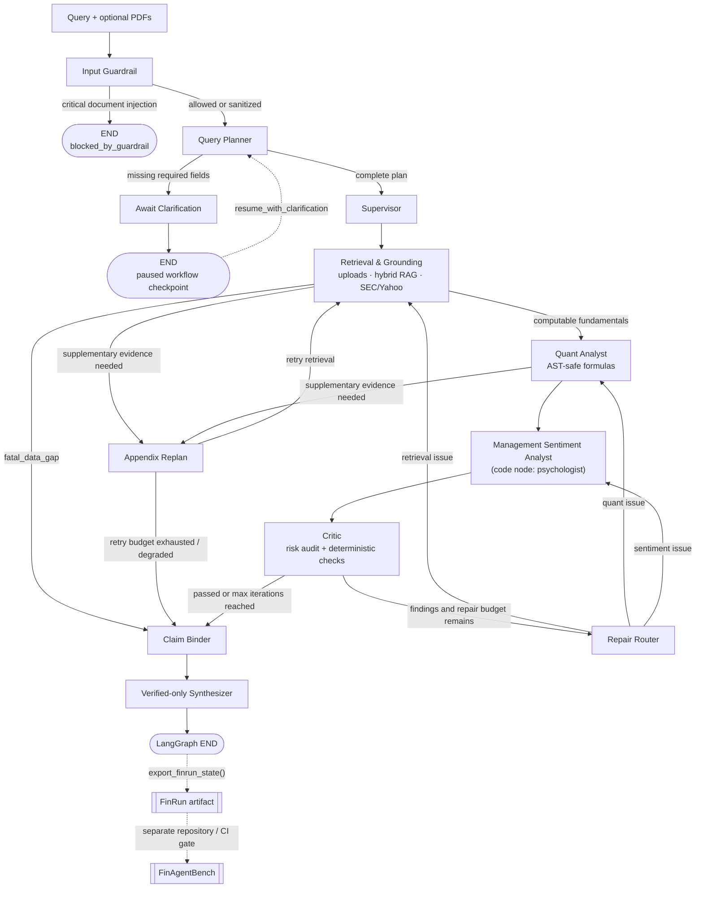
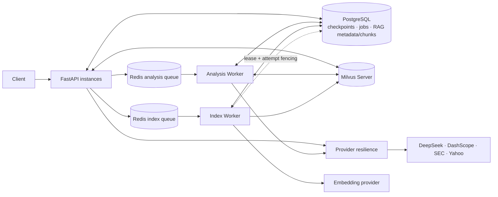

# LumenFin

**English** | [中文](README.zh-CN.md)

Evidence-grounded financial research **agent product** (LangGraph specialist
nodes, not independent multi-agent swarms). Sibling evaluator:
[FinAgentBench](https://github.com/majiali423/finagentbench-demo) scores
**exported FinRun traces**. That is an author-owned contract gate, not a
third-party market benchmark and not held-out product accuracy.

[](https://github.com/majiali423/lumenfin-agent/actions/workflows/ci.yml)

Published package **`0.1.0rc5`** (tag **`v0.1.0-rc.5`**). FinRun `1.0`. FinAgentBench pin
**`v0.1.0-rc.3`** (CI also fail-closes **`v0.1.0-rc.4`**).

**Official runtimes:** Python **3.12** on GitHub Actions (Ubuntu) and local
Windows 10/11. Classifiers list 3.11; required CI is 3.12 only.
**UI:** source checkout or Docker (`static/` is copied in the image). A
plain `pip install lumenfin-agent` wheel does **not** ship the web UI.

[Limitations](docs/PRODUCTION_LIMITATIONS.md) ·
[Architecture](docs/ARCHITECTURE.md) ·
[5-minute demos](docs/DEMO_GUIDE.md) ·
[Evidence index](docs/EVIDENCE_INDEX.md) ·
[Change summary](docs/PHASED_CHANGE_SUMMARY.md) ·
[Resume draft](docs/RESUME_DRAFT.md)

---

## Concrete problem

A fluent diligence paragraph can still:

- promote 10-K peer names into issuer scope;
- invent EBITDA margins with no structured inputs;
- look “correct” when only the last paragraph is judged;
- append a bogus `999999%` in visible text while a metric-only scorer still
  passes.

LumenFin makes those modes **visible and fail-closed**: plan → retrieve →
AST-safe quant (when TaskSpec requires it) → critic/repair → bind claims →
synthesize only verified facts. Missing revenue must not block an evidenced
**risk** answer; it must block **unevidenced numeric claims**.

---

## Visible result

Offline portfolio demo (no API key) asserts three stories in one process:

| Demo | What you should see |
|------|---------------------|
| **A** Normal evidenced answer | Issuer-only scope, formula claims bound to inputs, FinRun-exportable state |
| **B** Injected errors caught | Wrong number / wrong entity / missing citation / missing risk rejected (**local claim-binder 4/4**, not FinAgentBench product accuracy) |
| **C** Missing data, local refuse | Forced missing SEC+Yahoo → `incomplete_data`, **zero** invented numeric claims |

Web UI (source/Docker): question → **concise answer** → evidence ids → formula
inputs → **real** `audit_log` steps. Progress is job polling, not an 800ms
fake node timer. Refresh restores `?job=`.

Verified claim shape (abridged; full:
[docs/examples/verified_formula_claim.json](docs/examples/verified_formula_claim.json)):

```json
{
  "claim_id": "cl_num_Apple_ebitda_margin",
  "entity": "Apple",
  "claim_type": "numeric",
  "value": 0.3478,
  "unit": "ratio",
  "period": "FY2025",
  "verification": "verified"
}
```

---

## 5-minute offline reproduce

Supported on a **source checkout** (not wheel-only). Do not set
`PYTHON_DOTENV_DISABLED=1`. Do not overwrite an existing drifted `.venv`;
make a new venv if `pip show lumenfin-agent` is not `0.1.0rc5` or
`pip check` fails.

**1. Solo LumenFin** (no FinAgentBench). Fast tests and the offline UI do not
import the evaluator.

```powershell
python -m venv .venv
.\.venv\Scripts\python -m pip install -r requirements-lock.txt
.\.venv\Scripts\python -m pip install -e . --no-deps
.\.venv\Scripts\python -m pip show lumenfin-agent milvus-lite
.\.venv\Scripts\python -m pip check
copy .env.example .env
$env:APP_ENV = "test"
.\.venv\Scripts\python scripts\run_portfolio_demo.py
.\.venv\Scripts\python scripts\run_tests.py --fast
.\.venv\Scripts\python scripts\start_offline_demo_api.py
```

Then open `http://127.0.0.1:8000/`. Live keys are not required.

**Preferred demo question** (verified upload loop, NVIDIA FY2025 excerpt):

```text
Using uploaded files only, what is NVIDIA FY2025 operating income from the filing facts?
```

Upload `tests/fixtures/sec/derived/nvda_fy2025_10k_excerpt.pdf`. Gold operating
income is **81.453 billion USD** (hand-read from page 1, USD millions). Sample
catalog NVIDIA operating income is 72.4 — a matching 72.4 means sample
backfill, not the file. Missing-field path: upload
`tests/fixtures/sec/minimal/nvda_narrative_only.txt` with the same question.

**2. Dual working trees** (full tests + product v3 gate). The v3 scorer is
**not a published tag**. Point at the current `finagentbench-demo` working
tree. Do not invent a SHA.

```powershell
$env:FINAGENTBENCH_DIR = "<absolute path to finagentbench-demo>"
.\.venv\Scripts\python -m pip install -e $env:FINAGENTBENCH_DIR
.\.venv\Scripts\python scripts\run_tests.py --skip-joint
.\.venv\Scripts\python scripts\run_tests.py --joint-only
cd $env:FINAGENTBENCH_DIR
python -m unittest discover -s tests -v
$env:LUMENFIN_ROOT = "<absolute path to lumenfin-agent>"
python scripts\validate_cross_repo.py --profile ci
```

A `validate_cross_repo.py --profile ci` score of 100 is the **frozen sample
contract**, not product accuracy.

**3. Frozen published evaluator** (FinRun contract only):

```powershell
git clone --branch v0.1.0-rc.3 https://github.com/majiali423/finagentbench-demo.git
cd finagentbench-demo
python -m pip install -e .
$env:LUMENFIN_ROOT = "<path to lumenfin-agent>"
python scripts\validate_cross_repo.py --profile ci
```

CI also fail-closes `v0.1.0-rc.4`. Required GitHub jobs: `fast` → `offline`
(`run_tests.py --skip-joint` + portfolio) and **Product quality v3**
(`FINAGENTBENCH_PRODUCT_REF` must be a real published v3 commit/tag;
empty/main/master/rc.3/rc.4 are configuration failures, not skipped
successes). Frozen contract remains `finrun-contract` on rc.3/rc.4.
Publish order: land FinAgentBench v3 scorer → tag/commit that SHA → set
LumenFin `FINAGENTBENCH_PRODUCT_REF` → then rely on the product-quality
job. This checkout does not change GitHub variables. Remote Actions are
unverified until that ref exists.

---

## Architecture trade-offs (what I actually built)

- **One LangGraph `FinanceState`**, specialist **nodes**, not a mesh of
  independent agents. FastAPI + Redis queues + Milvus stay; no extra agent
  framework.
- **At-least-once** jobs (reservation token + lease). Not exactly-once.
- **HITL** pause/resume uses in-process LangGraph `InMemorySaver` plus a
  durable `WorkflowCheckpointRepository`. That is **not** a tested
  multi-process LangGraph node-level replay of every graph tick.
- **FinAgentBench is a sibling package** with versioned FinRun. I do not
  present 4/4, 11/11, or 14/14 as live product accuracy.
- **TaskSpec** (default on): risk/narrative questions are not fail-closed
  solely for missing AST ratios. **Bounded repair** exists, default **off**
  after an honest offline ablation.

---

## Effects, cost, limits

| Kind | What is true | What is not claimed |
|------|----------------|---------------------|
| Offline A/B/C | `run_portfolio_demo.py` must exit 0 | Production SLA / user count |
| Unit tests | Current dirty workspace: see [docs/PHASED_IMPROVEMENT_LOG.md](docs/PHASED_IMPROVEMENT_LOG.md) | Clean-install on every laptop |
| FinanceBench / LEDGER | Sealed historical canaries; do not rerun holdout to tune | General QA accuracy |
| Product-dev set | 36 hand gold items; **dev** ablation only; test frozen | 80%/95% target |
| Cost | Offline demos use `LocalFallbackLLM` (no token spend) | Live DeepSeek/SEC/Yahoo cost until you budget it |

Known gaps: keep a drifted existing `.venv` if you still need it; verify with
a **new** venv (`pip check`, metadata `0.1.0rc5`, milvus-lite 3.1.0).
pip-install wheel has no UI. Remote product-scorer CI is unverified until
`FINAGENTBENCH_PRODUCT_REF` is a published commit/tag.

Sealed numbers and reports: [docs/EVIDENCE_INDEX.md](docs/EVIDENCE_INDEX.md).
Operator limits: [docs/PRODUCTION_LIMITATIONS.md](docs/PRODUCTION_LIMITATIONS.md).

---

## Deeper docs

| Doc | Why |
|-----|-----|
| [docs/README.md](docs/README.md) | Full doc map |
| [docs/ARCHITECTURE.md](docs/ARCHITECTURE.md) | Graph, workers, checkpoints |
| [docs/PHASED_CHANGE_SUMMARY.md](docs/PHASED_CHANGE_SUMMARY.md) | Phases 0–6: bugs found and what changed |
| [docs/RESUME_DRAFT.md](docs/RESUME_DRAFT.md) | Honest resume bullets |
| [docs/EVIDENCE_INDEX.md](docs/EVIDENCE_INDEX.md) | Historical scores, hashes, reports (do not delete) |

---

## Agent control flow

Implementation: a **LangGraph state machine** of specialist nodes in
`src/lumenfin/graph.py`. Nodes share one `FinanceState`; they are not
independent multi-agent action loops.



```mermaid
flowchart TD
    IN["Query + optional PDFs"] --> IG["Input Guardrail"]

    IG -->|critical document injection| BLOCK(["END<br/>blocked_by_guardrail"])
    IG -->|allowed or sanitized| QP["Query Planner"]

    QP -->|missing required fields| HITL["Await Clarification"]
    HITL --> PAUSE(["END<br/>paused workflow checkpoint"])
    PAUSE -. "resume_with_clarification" .-> QP

    QP -->|complete plan| SUP["Supervisor"]
    SUP --> RET["Retrieval & Grounding<br/>uploads · hybrid RAG · SEC/Yahoo"]

    RET -->|fatal_data_gap| CB["Claim Binder"]
    RET -->|supplementary evidence needed| AR["Appendix Replan"]
    AR -->|retry retrieval| RET
    AR -->|retry budget exhausted / degraded| CB

    RET -->|computable fundamentals| QA["Quant Analyst<br/>AST-safe formulas"]
    QA -->|supplementary evidence needed| AR
    QA --> SENT["Management Sentiment Analyst<br/>(code node: psychologist)"]

    SENT --> CR["Critic<br/>risk audit + deterministic checks"]

    CR -->|findings and repair budget remains| REP["Repair Router"]
    REP -->|retrieval issue| RET
    REP -->|quant issue| QA
    REP -->|sentiment issue| SENT

    CR -->|passed or max iterations reached| CB

    CB --> SYN["Verified-only Synthesizer"]
    SYN --> GEND(["LangGraph END"])

    GEND -. "export_finrun_state()" .-> FR[["FinRun artifact"]]
    FR -. "separate repository / CI gate" .-> FAB[["FinAgentBench"]]
```

| Phase | Nodes | Responsibility |
|-------|--------|----------------|
| Plan | `input_guardrail`, `query_planner`, `supervisor` | Input protection, intent/entity plan, clarification, execution plan |
| Acquire | `retrieval`, `appendix_replan` | Document/provider grounding and supplementary evidence |
| Analyze | `quant`, `psychologist` | AST-safe financial calculations and management-sentiment analysis |
| Validate and repair | `critic`, `repair`, `claim_binder` | Completeness checks, directed re-run, Claim–Evidence Binding |
| Publish (in-graph) | `synthesizer` → `END` | Verified-only report; LangGraph ends here |
| Evaluate (out-of-graph) | FinRun export, FinAgentBench, optional FinanceBench/LEDGER | Replay evaluator + sealed RAG canaries (not product accuracy) |

Routing details and edge conditions: [docs/ARCHITECTURE.md](docs/ARCHITECTURE.md).

### Critic vs Repair vs Claim Binder

These are **not** the same gate.

**Critic** — `deterministic completeness checks + risk/compliance audit`.
It inspects whether intermediate analysis is present and structurally complete
(quant results, sentiment, risk/compliance outputs, state gaps). It is not a
pure LLM judge.

**Repair** — an **evaluator–router–retry** mechanism. It does **not** rewrite
the final report. From structured violations it routes back to
`retrieval` / `quant` / `psychologist` under `critic_max_iterations`. Only
retrieval-worthy violations re-run expensive retrieval.

**Claim Binder** — validates individual reportable facts against evidence:
entity, metric, value, unit, period, citation / `source_record_id`, formula
inputs. Only verified claims may enter the synthesizer.

> Critic validates workflow completeness.  
> Repair reruns the responsible upstream stage.  
> Claim Binder validates individual reportable facts.

### Fail-closed path

```text
retrieval detects fatal_data_gap
→ skip quant / sentiment / critic loops
→ claim_binder
→ synthesizer
→ workflow_status = incomplete_data
```

Why: without AST-computable fundamentals, Quant must not invent defaults,
Critic/Repair must not idle-loop, and Synthesizer must not forge ratios.

> Fail-closed means the system refuses unsupported numeric conclusions.  
> It does not prove that every accepted upstream source is universally correct.

---

## Evidence / trust chain

```text
PDF / SEC / Yahoo / market providers
→ normalized fundamentals and provenance
→ AST-safe calculations
→ typed claims
→ entity / metric / value / unit / period / citation binding
→ verified claims only
→ report + FinRun
→ independent replay evaluation
```

- RAG evidence is **not** automatically equivalent to structured fundamentals.
- A fluent sentence is **not** automatically a verified Claim.

---

## LLM vs deterministic responsibilities

| Concern | LLM-assisted | Deterministic / programmatic |
|---------|--------------|------------------------------|
| Query understanding | Intent/entity extraction fallback | Required-field and clarification routing |
| Retrieval | Query phrasing and profile generation | Provider order, issuer scope, tenant filters |
| Financial calculations | No arithmetic authority | AST-safe formulas over structured inputs |
| Critic | Short compliance narrative | Violation codes and repair routing |
| Evidence verification | No final authority | Entity/value/unit/period/citation matching |
| Report generation | Language synthesis | Only verified claims are eligible |
| Evaluation | Optional semantic judge | Replay-first deterministic gates |

The system uses LLMs where language helps; it does **not** treat Claim Binder
as proof of absolute world-truth.

---

## Engineering reliability

| Concern | Design |
|---------|--------|
| Persistence | PostgreSQL-first (SQLite only for `test` / explicit dev opt-in) |
| Queues | Redis pending → processing → dead-letter; reclaim without manual redelivery |
| Workers | **Analysis Worker** (`src/lumenfin/worker.py`) consumes the analysis queue; **Index Worker** (`scripts/run_rag_index_worker.py`) consumes the index queue with lease + attempt fencing |
| Providers | Single retry owner, deadline, Retry-After, jitter, degraded fallback, per-process bulkhead |
| Tenancy | API-key principal binding; tenant-scoped jobs, checkpoints, and RAG lookups ([boundary](docs/MULTI_TENANCY_BOUNDARY.md)) |

---

## Historical gates (index)

Dated snapshots (including the 2026-08-13 post-rc4 snapshot) and sealed retrieval scores are listed in
[docs/EVIDENCE_INDEX.md](docs/EVIDENCE_INDEX.md) (original reports are kept).
Do **not** merge them into one accuracy number. Live HEAD is
[ci.yml](https://github.com/majiali423/lumenfin-agent/actions/workflows/ci.yml)
on the current commit, plus `python scripts/run_tests.py` locally.

Operator limits: [docs/PRODUCTION_LIMITATIONS.md](docs/PRODUCTION_LIMITATIONS.md).

---

## Runtime topology

PostgreSQL, Redis, and Milvus are **different roles**, not a single pipeline.
API ↔ PostgreSQL / Milvus are bidirectional request paths, not
`API → DB → Redis → Worker → Milvus` only.


```mermaid
flowchart LR
    CLIENT["Client"] --> API["FastAPI instances"]

    API <--> PG[("PostgreSQL<br/>checkpoints · jobs · RAG metadata/chunks")]
    API --> AQ[("Redis analysis queue")]
    API --> IQ[("Redis index queue")]

    AQ --> AW["Analysis Worker"]
    IQ --> IW["Index Worker"]

    AW <--> PG
    IW <--> PG
    API <--> MV[("Milvus Server")]
    AW <--> MV
    IW --> MV

    API --> PR["Provider resilience"]
    AW --> PR
    IW --> EMB["Embedding provider"]
    PR --> EXT["DeepSeek · DashScope · SEC · Yahoo"]

    IW -. "lease + attempt fencing" .-> PG
```

- Analysis queue and index queue are **separate** Redis queues (both
  **at-least-once**, not exactly-once)
- Analysis Worker: reserve / ACK / retry / DLQ around `run_job()`
- Index Worker: PostgreSQL lease + attempt fencing recovers killed workers
- Bulkhead is **per-process**, not a global distributed rate limit
- Provider HTTP retry ≠ Redis job retry ≠ appendix replan (different layers)

Full topology notes: [docs/ARCHITECTURE.md](docs/ARCHITECTURE.md).

---

## Design trade-offs

- **At-least-once queues + fencing over exactly-once.** Distributed exactly-once
  delivery would need far heavier coordination; instead PostgreSQL leases and
  attempt fencing make redelivery safe, so a killed worker recovers without
  human action.
- **Bounded repair instead of unbounded critic loops.** `critic_max_iterations`
  caps the loop, and only retrieval-worthy violation codes may re-run expensive
  retrieval — an unbounded critic loop burns provider budget for little gain.
- **Fail-closed over graceful-looking defaults.** A missing-fundamentals run
  returns `incomplete_data` and a data-limitation claim rather than a plausible
  ratio, because a wrong number is more expensive than a missing one here.
- **Credential-bound logical tenant isolation.** API keys map to server-side
  principals; jobs, checkpoints, and RAG paths enforce the authorized tenant.
  Remaining gaps are external IdP/OIDC, RBAC, PostgreSQL RLS, and physical
  per-tenant infrastructure ([boundary](docs/MULTI_TENANCY_BOUNDARY.md)).

---

## Limitations

The validated results above were produced under controlled multi-process and
deterministic fault-injection conditions, not in sustained production traffic.

- Portfolio RC / controlled deployment candidate — **not** unrestricted production readiness
- At-least-once queues — **not** exactly-once
- Per-process bulkhead — **not** cross-process global rate limit
- Controlled synthetic live smoke passed for DeepSeek, DashScope embedding,
  and Qwen3 rerank; both repositories' full local validation gates passed
- Published tag `v0.1.0-rc.3` with green GitHub Actions on `main` / tag; remaining
  gaps are soak, production IdP/RBAC/RLS, and public image redistribution — not “untagged”
- Docs on `main` may be one or more commits ahead of the immutable RC tag
- Not investment advice; human financial review required
- PyMuPDF / MinIO AGPL (and Redis RSALv2/SSPL) limit public image redistribution;
  do not present the application image as a pure-MIT Docker distribute

Full text: [docs/PRODUCTION_LIMITATIONS.md](docs/PRODUCTION_LIMITATIONS.md)

---

## Documentation map

| Doc | Purpose |
|-----|---------|
| [docs/README.md](docs/README.md) | Doc index |
| [docs/ARCHITECTURE.md](docs/ARCHITECTURE.md) | Agent control flow + runtime architecture |
| [docs/MULTI_TENANCY_BOUNDARY.md](docs/MULTI_TENANCY_BOUNDARY.md) | Tenant isolation scope |
| [docs/CONFIGURATION.md](docs/CONFIGURATION.md) | Environment variables and provider pins |
| [docs/REPRODUCIBILITY.md](docs/REPRODUCIBILITY.md) | Reproducing the frozen evidence |
| [docs/DEMO_GUIDE.md](docs/DEMO_GUIDE.md) | Offline demo walkthrough |
| [docs/PORTFOLIO_RELEASE_REPORT.md](docs/PORTFOLIO_RELEASE_REPORT.md) | Freeze evidence |
| [docs/QUEUE_WORKER_INTEGRATION.md](docs/QUEUE_WORKER_INTEGRATION.md) | Multi-process queue/worker evidence |
| [docs/PROVIDER_RESILIENCE.md](docs/PROVIDER_RESILIENCE.md) | Provider fault-injection evidence |
| [docs/PRODUCTION_LIMITATIONS.md](docs/PRODUCTION_LIMITATIONS.md) | Controlled RC boundary + validated gate summary |
| [CHANGELOG.md](CHANGELOG.md) | Version history |
| [docs/VALIDATION_COMMANDS.md](docs/VALIDATION_COMMANDS.md) | Supported commands |
| [docs/FINANCEBENCH_EVAL.md](docs/FINANCEBENCH_EVAL.md) | External FinanceBench page retrieval (consumed; Phase 4 `NOT_RUN`) |
| [docs/FINANCEBENCH_NEXT_PHASE.md](docs/FINANCEBENCH_NEXT_PHASE.md) | LEDGER public-dev sealed/stopped; production stays A |

---

## Repository layout

```text
src/lumenfin/           Agent runtime, grounding, claims, FinRun, RAG, providers
src/lumenfin/eval/      FinanceBench + LEDGER eval harness (does not change production RAG)
tests/                  Offline regression
scripts/                Tests, demos, workers, sealed eval runners
docs/                   Architecture and release docs
data/eval_rag/          Tracked aggregates only (no raw questions or PDFs)
reports/current/        Authoritative RC evidence packs
```

---

## License / disclaimer

LumenFin's own source code is licensed under the
[MIT License](LICENSE). Third-party dependencies and source data retain their
own terms; see [THIRD_PARTY_NOTICES.md](THIRD_PARTY_NOTICES.md).

The current application image contains PyMuPDF (AGPL-3.0/commercial), and the
Compose stack references AGPL MinIO plus source-available Redis 7.4. Do not
publish the image as a purely MIT artifact until those obligations are
resolved. Research output is for engineering evaluation only and is **not
investment advice**.
