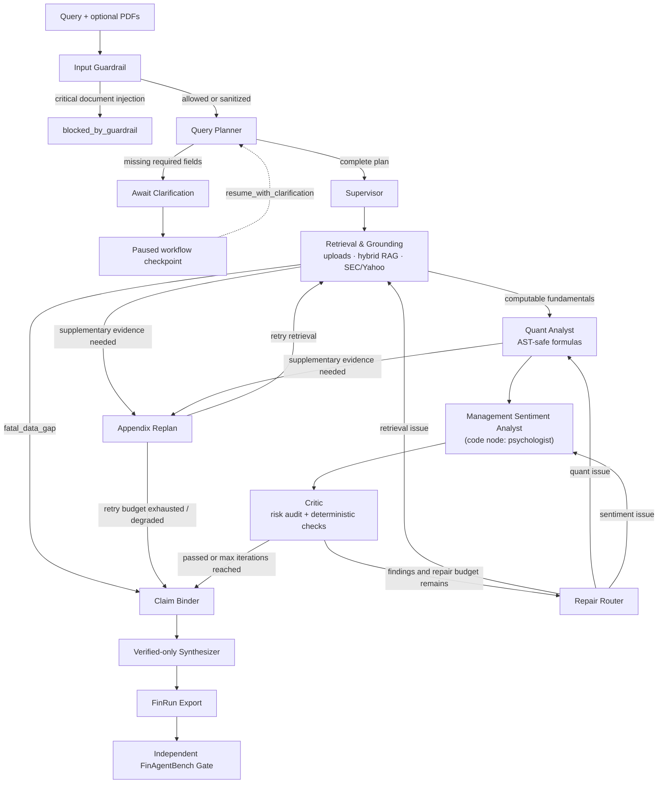
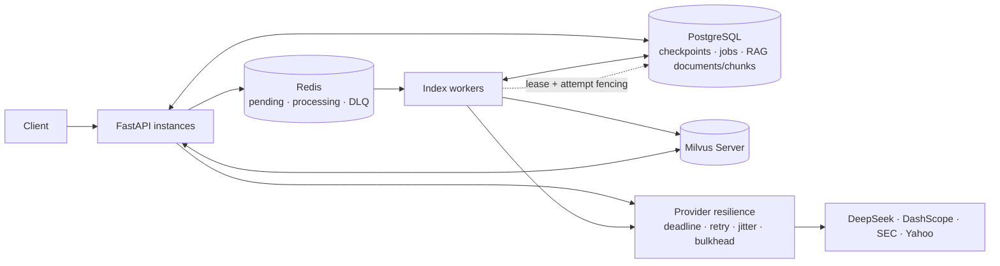

# LumenFin

**Evidence-grounded financial research agent with explicit
planner–critic–repair control flow**

LangGraph-orchestrated specialist nodes (not a swarm of fully autonomous
agents): plan → retrieve → analyze → check → repair → bind evidence →
synthesize only what is verified.

[](https://github.com/majiali423/lumenfin-agent/actions/workflows/ci.yml)

Release candidate: **`0.1.0rc2`** (`v0.1.0-rc.2`) · FinRun schema: `1.0` ·
FinAgentBench pin: **`v0.1.0-rc.2`**

LumenFin is a **portfolio release candidate** validated under controlled
multi-process and deterministic fault-injection conditions. These results are
**not** a certification of unrestricted production readiness.

[Docs](docs/README.md) · [Architecture](docs/FINAL_ARCHITECTURE.md) ·
[Limitations](docs/PRODUCTION_LIMITATIONS.md) · [Demo](docs/DEMO_GUIDE.md) ·
[Release report](docs/PORTFOLIO_RELEASE_REPORT.md)

---

## What problem it solves

Typical financial RAG demos often:

- promote peers out of a 10-K body into issuer scope;
- invent ratios without structured inputs;
- emit fluent claims without citations;
- look “correct” when only the final paragraph is judged.

LumenFin makes those failure modes **visible** and **fail-closed**: it plans
the work, acquires evidence, runs specialist analysis nodes, audits
completeness, repairs with a bounded retry loop, binds claims to evidence, and
refuses unsupported numeric conclusions when fundamentals are missing.

---

## 30-second offline demo

Deterministic · offline · no API key · non-zero exit on failure.

```powershell
python scripts/run_portfolio_demo.py
```

| Demo | Story |
|------|--------|
| **A** Trusted normal analysis | Issuer scope, grounded claims, citations, FinRun export |
| **B** Isolation & mutation detection | Multi-company isolation; mutation **4/4**; tenant leakage **0** |
| **C** Fail-closed | Missing fundamentals → `incomplete_data`; no forged numerics |

Interview walkthrough: [docs/DEMO_GUIDE.md](docs/DEMO_GUIDE.md)

---

## Agent control flow

Implementation: a **LangGraph state machine** of specialist nodes in
`src/lumenfin/graph.py`. Nodes share one `FinanceState`; they are not
independent multi-agent action loops.


```mermaid
flowchart TD
    IN["Query + optional PDFs"] --> IG["Input Guardrail"]

    IG -->|critical document injection| BLOCK["blocked_by_guardrail"]
    IG -->|allowed or sanitized| QP["Query Planner"]

    QP -->|missing required fields| HITL["Await Clarification"]
    HITL --> PAUSE["Paused workflow checkpoint"]
    PAUSE -. "resume_with_clarification" .-> QP

    QP -->|complete plan| SUP["Supervisor"]
    SUP --> RET["Retrieval & Grounding<br/>uploads · hybrid RAG · SEC/Yahoo"]

    RET -->|fatal_data_gap| CB["Claim Binder"]
    RET -->|supplementary evidence needed| AR["Appendix Replan"]
    AR -->|retry retrieval| RET
    AR -->|retry budget exhausted / degraded| CB

    RET -->|computable fundamentals| QA["Quant Analyst<br/>AST-safe formulas"]
    QA -->|supplementary evidence needed| AR
    QA --> SENT["Management Sentiment Analyst<br/>(code node: psychologist)"]

    SENT --> CR["Critic<br/>risk audit + deterministic checks"]

    CR -->|findings and repair budget remains| REP["Repair Router"]
    REP -->|retrieval issue| RET
    REP -->|quant issue| QA
    REP -->|sentiment issue| SENT

    CR -->|passed or max iterations reached| CB

    CB --> SYN["Verified-only Synthesizer"]
    SYN --> FR["FinRun Export"]
    FR --> FAB["Independent FinAgentBench Gate"]
```

| Phase | Nodes | Responsibility |
|-------|--------|----------------|
| Plan | `input_guardrail`, `query_planner`, `supervisor` | Input protection, intent/entity plan, clarification, execution plan |
| Acquire | `retrieval`, `appendix_replan` | Document/provider grounding and supplementary evidence |
| Analyze | `quant`, `psychologist` | AST-safe financial calculations and management-sentiment analysis |
| Validate and repair | `critic`, `repair`, `claim_binder` | Completeness checks, directed re-run, Claim–Evidence Binding |
| Publish and evaluate | `synthesizer`, FinRun, FinAgentBench | Verified-only report and independent evaluation |

Routing details and edge conditions: [docs/FINAL_ARCHITECTURE.md](docs/FINAL_ARCHITECTURE.md).

### Critic vs Repair vs Claim Binder

These are **not** the same gate.

**Critic** — `deterministic completeness checks + risk/compliance audit`.
It inspects whether intermediate analysis is present and structurally complete
(quant results, sentiment, risk/compliance outputs, state gaps). It is not a
pure LLM judge.

**Repair** — an **evaluator–router–retry** mechanism. It does **not** rewrite
the final report. From structured violations it routes back to
`retrieval` / `quant` / `psychologist` under `critic_max_iterations`. Only
retrieval-worthy violations re-run expensive retrieval.

**Claim Binder** — validates individual reportable facts against evidence:
entity, metric, value, unit, period, citation / `source_record_id`, formula
inputs. Only verified claims may enter the synthesizer.

> Critic validates workflow completeness.  
> Repair reruns the responsible upstream stage.  
> Claim Binder validates individual reportable facts.

### Fail-closed path

```text
retrieval detects fatal_data_gap
→ skip quant / sentiment / critic loops
→ claim_binder
→ synthesizer
→ workflow_status = incomplete_data
```

Why: without AST-computable fundamentals, Quant must not invent defaults,
Critic/Repair must not idle-loop, and Synthesizer must not forge ratios.

> Fail-closed means the system refuses unsupported numeric conclusions.  
> It does not prove that every accepted upstream source is universally correct.

---

## Evidence / trust chain

```text
PDF / SEC / Yahoo / market providers
→ normalized fundamentals and provenance
→ AST-safe calculations
→ typed claims
→ entity / metric / value / unit / period / citation binding
→ verified claims only
→ report + FinRun
→ independent replay evaluation
```

- RAG evidence is **not** automatically equivalent to structured fundamentals.
- A fluent sentence is **not** automatically a verified Claim.

---

## LLM vs deterministic responsibilities

| Concern | LLM-assisted | Deterministic / programmatic |
|---------|--------------|------------------------------|
| Query understanding | Intent/entity extraction fallback | Required-field and clarification routing |
| Retrieval | Query phrasing and profile generation | Provider order, issuer scope, tenant filters |
| Financial calculations | No arithmetic authority | AST-safe formulas over structured inputs |
| Critic | Short compliance narrative | Violation codes and repair routing |
| Evidence verification | No final authority | Entity/value/unit/period/citation matching |
| Report generation | Language synthesis | Only verified claims are eligible |
| Evaluation | Optional semantic judge | Replay-first deterministic gates |

The system uses LLMs where language helps; it does **not** treat Claim Binder
as proof of absolute world-truth.

---

## Engineering reliability

| Concern | Design |
|---------|--------|
| Persistence | PostgreSQL-first (SQLite only for `test` / explicit dev opt-in) |
| Queues | Redis pending → processing → dead-letter; reclaim without manual redelivery |
| Workers | Index lease + attempt fencing; kill → automatic reclaim |
| Providers | Single retry owner, deadline, Retry-After, jitter, degraded fallback, per-process bulkhead |
| Tenancy | RAG data-plane tenant-aware logical isolation ([boundary](docs/MULTI_TENANCY_BOUNDARY.md)) |

---

## Validated results (separate gates)

Do **not** merge these into one “accuracy” number.

| Gate | What it measures | Result |
|------|------------------|--------|
| **Unit regression** | Offline Python tests | **453 passed, 1 skipped** |
| **Infrastructure integration** | Phase 3.2B multi-process Docker | **PASS** (`20260804T095357Z`) |
| Worker-kill manual redelivery | Must stay false | **false** |
| Tenant leakage | Cross-tenant RAG read | **0** |
| Orphan chunks / vectors | Index compensation | **0 / 0** |
| **Provider fault validation** | Phase 3.3A + Docker dual-API | **PASS** (`docker_20260804T100817Z`) |
| Dual-API logical / physical calls | Stub reconciliation | **20 / 25** |
| Provider unexpected failures | Scenario G | **0** |
| **Benchmark reliability** | FinAgentBench completed-case mean | **92.97** (informational) |
| Mutation detection | Wrong entity/number/citation/risk | **4/4** |

Evidence: [PHASE32B](docs/PHASE32B_INTEGRATION_REPORT.md) ·
[PHASE33A](docs/PHASE33A_PROVIDER_RESILIENCE_REPORT.md) ·
[RC reliability](reports/current/LumenFin_RC_Final_Reliability_Report.md) ·
[Compatibility](reports/current/Joint_Compatibility_Report.md)

---

## Runtime topology

PostgreSQL, Redis, and Milvus are **different roles**, not a single pipeline.
API ↔ PostgreSQL / Milvus are bidirectional request paths, not
`API → DB → Redis → Worker → Milvus` only.


```mermaid
flowchart LR
    CLIENT["Client"] --> API["FastAPI instances"]

    API <--> PG[("PostgreSQL<br/>checkpoints · jobs · RAG documents/chunks")]
    API --> REDIS[("Redis<br/>pending · processing · DLQ")]
    REDIS --> WORKER["Index workers"]

    WORKER <--> PG
    WORKER --> MILVUS[("Milvus Server")]
    API <--> MILVUS

    API --> RES["Provider resilience<br/>deadline · retry · jitter · bulkhead"]
    WORKER --> RES
    RES --> EXT["DeepSeek · DashScope · SEC · Yahoo"]

    WORKER -. "lease + attempt fencing" .-> PG
```

- Redis queues are **at-least-once**, not exactly-once
- PostgreSQL lease + attempt fencing recovers killed workers
- Bulkhead is **per-process**, not a global distributed rate limit

Details: [docs/FINAL_ARCHITECTURE.md](docs/FINAL_ARCHITECTURE.md)

---

## Quick start

Supported CI Python: **3.12**. Prefer the lockfile path.

```powershell
python -m venv .venv
.\.venv\Scripts\python -m pip install -r requirements-lock.txt
.\.venv\Scripts\python -m pip install -e . --no-deps
copy .env.example .env
.\.venv\Scripts\python scripts\run_tests.py
.\.venv\Scripts\python scripts\run_portfolio_demo.py
```

Live providers need keys in `.env` (never commit them). See
[docs/CONFIGURATION.md](docs/CONFIGURATION.md).

FinAgentBench (optional sibling / published tag **`v0.1.0-rc.2`**):
[majiali423/finagentbench-demo](https://github.com/majiali423/finagentbench-demo)

---

## Limitations

- Portfolio RC / controlled deployment candidate — **not** unrestricted production-ready
- At-least-once queues — **not** exactly-once
- Per-process bulkhead — **not** cross-process global rate limit
- Live provider smoke: **skipped** in current release evidence
- Not investment advice; human financial review required
- PyMuPDF license limits public image redistribution

Full text: [docs/PRODUCTION_LIMITATIONS.md](docs/PRODUCTION_LIMITATIONS.md)

---

## Documentation map

| Doc | Purpose |
|-----|---------|
| [docs/README.md](docs/README.md) | Doc index |
| [docs/FINAL_ARCHITECTURE.md](docs/FINAL_ARCHITECTURE.md) | Agent control flow + runtime architecture |
| [docs/MULTI_TENANCY_BOUNDARY.md](docs/MULTI_TENANCY_BOUNDARY.md) | Tenant isolation scope |
| [docs/PORTFOLIO_RELEASE_REPORT.md](docs/PORTFOLIO_RELEASE_REPORT.md) | Freeze evidence |
| [CHANGELOG.md](CHANGELOG.md) | Version history |
| [docs/VALIDATION_COMMANDS.md](docs/VALIDATION_COMMANDS.md) | Supported commands |

## Repository layout

```text
src/lumenfin/     Agent runtime, grounding, claims, FinRun, RAG, providers
tests/            Offline regression
scripts/          Tests, demos, Phase 3.2B/3.3A harnesses
docs/             Architecture and release docs
reports/current/  Authoritative RC evidence packs
```

## License / disclaimer

No public open-source license has been selected. Research output is for
engineering evaluation only and is **not investment advice**.
Third-party notices: [THIRD_PARTY_NOTICES.md](THIRD_PARTY_NOTICES.md).
