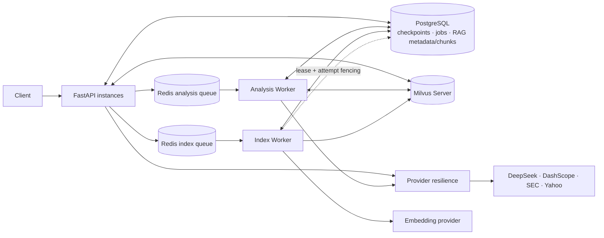

# LumenFin

**English** | [中文](README.zh-CN.md)

**Evidence-grounded financial research agent with an explicit
planner–critic–repair control flow**

LangGraph-orchestrated specialist nodes (not independent autonomous agents):
plan → retrieve → analyze → check → repair → bind evidence → synthesize only
what is verified.

[](https://github.com/majiali423/lumenfin-agent/actions/workflows/ci.yml)

Python 3.12 · FastAPI · LangGraph · PostgreSQL · Redis · Milvus ·
Docker Compose · pytest

Working release candidate **`0.1.0rc3`** · FinRun schema `1.0` ·
FinAgentBench evaluator pin **`v0.1.0-rc.3`** · final closure commit/tag not
created yet · **portfolio release candidate**, not a certification of
unrestricted production readiness
([limitations](docs/PRODUCTION_LIMITATIONS.md))

[Docs](docs/README.md) · [Architecture](docs/FINAL_ARCHITECTURE.md) ·
[Limitations](docs/PRODUCTION_LIMITATIONS.md) · [Demo](docs/DEMO_GUIDE.md) ·
[Release report](docs/PORTFOLIO_RELEASE_REPORT.md)

---

## What problem it solves

Typical financial RAG demos often:

- promote peers out of a 10-K body into issuer scope;
- invent ratios without structured inputs;
- emit fluent claims without citations;
- look “correct” when only the final paragraph is judged.

LumenFin makes those failure modes **visible** and **fail-closed**: it plans
the work, acquires evidence, runs specialist analysis nodes, audits
completeness, repairs with a bounded retry loop, binds claims to evidence, and
refuses unsupported numeric conclusions when fundamentals are missing.

---

## One-command offline demo

Deterministic · offline · no API key · non-zero exit on failure.

```powershell
python scripts/run_portfolio_demo.py
```

| Demo | What this run asserts |
|------|-----------------------|
| **A** Trusted normal analysis | Issuer-only scope, grounded claims with citations, FinRun-exportable state |
| **B** Isolation & error detection | Apple/Microsoft stay in scope; wrong number / wrong entity / missing citation / missing risk all rejected (**4/4**) |
| **C** Fail-closed | Forced missing SEC + Yahoo → `workflow_status = incomplete_data`, zero numeric claims |

The run also **prints** validated references it does not re-prove offline
(Phase 3.2B tenant leakage `0`, Phase 3.3A Docker run id); the Docker stack is
not started by this entrypoint. Walkthrough: [docs/DEMO_GUIDE.md](docs/DEMO_GUIDE.md)

### What a verified claim looks like

Illustrative abridged shape of a verified formula claim (IDs and binding rules
match `src/lumenfin/claims.py`; full example:
[docs/examples/verified_formula_claim.json](docs/examples/verified_formula_claim.json)):

```json
{
  "claim_id": "cl_num_Apple_ebitda_margin",
  "entity": "Apple",
  "claim_type": "numeric",
  "statement": "Apple EBITDA margin is 34.8% for FY2025.",
  "value": 0.3478, "unit": "ratio", "period": "FY2025",
  "metric_name": "ebitda_margin",
  "evidence_refs": [
    {
      "evidence_id": "ev_fund_Apple_ebitda_FY2025",
      "citation": "lumenfin:sec_companyfacts:Apple:FY2025:ebitda",
      "source_type": "sec_companyfacts", "period": "FY2025"
    },
    {
      "evidence_id": "ev_fund_Apple_revenue_FY2025",
      "citation": "lumenfin:sec_companyfacts:Apple:FY2025:revenue",
      "source_type": "sec_companyfacts", "period": "FY2025"
    }
  ],
  "verification": "verified",
  "verify_reason": "Metric/period/unit-bound evidence (formula_inputs_bound); formula_inputs={'ebitda': 'ev_fund_Apple_ebitda_FY2025', 'revenue': 'ev_fund_Apple_revenue_FY2025'}"
}
```

`ebitda_margin` is a formula claim: it must bind **both** `ebitda` and
`revenue` fundamentals evidence (`FORMULA_INPUTS` in `claims.py`), not a single
`ev_fund_{company}_{period}` id.

With no AST-computable fundamentals, the same pipeline emits a data-limitation
claim instead of a ratio (full shape:
[docs/examples/fail_closed_data_limitation_claim.json](docs/examples/fail_closed_data_limitation_claim.json)):

```json
{
  "claim_id": "cl_risk_OpenAI_supply",
  "entity": "OpenAI",
  "claim_type": "risk_conclusion",
  "statement": "OpenAI data-limitation risk is elevated: no AST-computable fundamentals (structured_source=none).",
  "value": "elevated",
  "metric_name": "data_limitation_risk",
  "evidence_refs": [{
    "evidence_id": "ev_gap_OpenAI",
    "citation": "lumenfin:data_gap:OpenAI:none",
    "source_type": "data_gap"
  }],
  "verification": "verified",
  "verify_reason": "Fail-closed data-limitation risk bound to structured_source=none provenance."
}
```

---

## Agent control flow

Implementation: a **LangGraph state machine** of specialist nodes in
`src/lumenfin/graph.py`. Nodes share one `FinanceState`; they are not
independent multi-agent action loops.


```mermaid
flowchart TD
    IN["Query + optional PDFs"] --> IG["Input Guardrail"]

    IG -->|critical document injection| BLOCK(["END<br/>blocked_by_guardrail"])
    IG -->|allowed or sanitized| QP["Query Planner"]

    QP -->|missing required fields| HITL["Await Clarification"]
    HITL --> PAUSE(["END<br/>paused workflow checkpoint"])
    PAUSE -. "resume_with_clarification" .-> QP

    QP -->|complete plan| SUP["Supervisor"]
    SUP --> RET["Retrieval & Grounding<br/>uploads · hybrid RAG · SEC/Yahoo"]

    RET -->|fatal_data_gap| CB["Claim Binder"]
    RET -->|supplementary evidence needed| AR["Appendix Replan"]
    AR -->|retry retrieval| RET
    AR -->|retry budget exhausted / degraded| CB

    RET -->|computable fundamentals| QA["Quant Analyst<br/>AST-safe formulas"]
    QA -->|supplementary evidence needed| AR
    QA --> SENT["Management Sentiment Analyst<br/>(code node: psychologist)"]

    SENT --> CR["Critic<br/>risk audit + deterministic checks"]

    CR -->|findings and repair budget remains| REP["Repair Router"]
    REP -->|retrieval issue| RET
    REP -->|quant issue| QA
    REP -->|sentiment issue| SENT

    CR -->|passed or max iterations reached| CB

    CB --> SYN["Verified-only Synthesizer"]
    SYN --> GEND(["LangGraph END"])

    GEND -. "export_finrun_state()" .-> FR[["FinRun artifact"]]
    FR -. "separate repository / CI gate" .-> FAB[["FinAgentBench"]]
```

| Phase | Nodes | Responsibility |
|-------|--------|----------------|
| Plan | `input_guardrail`, `query_planner`, `supervisor` | Input protection, intent/entity plan, clarification, execution plan |
| Acquire | `retrieval`, `appendix_replan` | Document/provider grounding and supplementary evidence |
| Analyze | `quant`, `psychologist` | AST-safe financial calculations and management-sentiment analysis |
| Validate and repair | `critic`, `repair`, `claim_binder` | Completeness checks, directed re-run, Claim–Evidence Binding |
| Publish (in-graph) | `synthesizer` → `END` | Verified-only report; LangGraph ends here |
| Evaluate (out-of-graph) | FinRun export, FinAgentBench | Post-run artifact + independent sibling evaluator |

Routing details and edge conditions: [docs/FINAL_ARCHITECTURE.md](docs/FINAL_ARCHITECTURE.md).

### Critic vs Repair vs Claim Binder

These are **not** the same gate.

**Critic** — `deterministic completeness checks + risk/compliance audit`.
It inspects whether intermediate analysis is present and structurally complete
(quant results, sentiment, risk/compliance outputs, state gaps). It is not a
pure LLM judge.

**Repair** — an **evaluator–router–retry** mechanism. It does **not** rewrite
the final report. From structured violations it routes back to
`retrieval` / `quant` / `psychologist` under `critic_max_iterations`. Only
retrieval-worthy violations re-run expensive retrieval.

**Claim Binder** — validates individual reportable facts against evidence:
entity, metric, value, unit, period, citation / `source_record_id`, formula
inputs. Only verified claims may enter the synthesizer.

> Critic validates workflow completeness.  
> Repair reruns the responsible upstream stage.  
> Claim Binder validates individual reportable facts.

### Fail-closed path

```text
retrieval detects fatal_data_gap
→ skip quant / sentiment / critic loops
→ claim_binder
→ synthesizer
→ workflow_status = incomplete_data
```

Why: without AST-computable fundamentals, Quant must not invent defaults,
Critic/Repair must not idle-loop, and Synthesizer must not forge ratios.

> Fail-closed means the system refuses unsupported numeric conclusions.  
> It does not prove that every accepted upstream source is universally correct.

---

## Evidence / trust chain

```text
PDF / SEC / Yahoo / market providers
→ normalized fundamentals and provenance
→ AST-safe calculations
→ typed claims
→ entity / metric / value / unit / period / citation binding
→ verified claims only
→ report + FinRun
→ independent replay evaluation
```

- RAG evidence is **not** automatically equivalent to structured fundamentals.
- A fluent sentence is **not** automatically a verified Claim.

---

## LLM vs deterministic responsibilities

| Concern | LLM-assisted | Deterministic / programmatic |
|---------|--------------|------------------------------|
| Query understanding | Intent/entity extraction fallback | Required-field and clarification routing |
| Retrieval | Query phrasing and profile generation | Provider order, issuer scope, tenant filters |
| Financial calculations | No arithmetic authority | AST-safe formulas over structured inputs |
| Critic | Short compliance narrative | Violation codes and repair routing |
| Evidence verification | No final authority | Entity/value/unit/period/citation matching |
| Report generation | Language synthesis | Only verified claims are eligible |
| Evaluation | Optional semantic judge | Replay-first deterministic gates |

The system uses LLMs where language helps; it does **not** treat Claim Binder
as proof of absolute world-truth.

---

## Engineering reliability

| Concern | Design |
|---------|--------|
| Persistence | PostgreSQL-first (SQLite only for `test` / explicit dev opt-in) |
| Queues | Redis pending → processing → dead-letter; reclaim without manual redelivery |
| Workers | **Analysis Worker** (`src/lumenfin/worker.py`) consumes the analysis queue; **Index Worker** (`scripts/run_rag_index_worker.py`) consumes the index queue with lease + attempt fencing |
| Providers | Single retry owner, deadline, Retry-After, jitter, degraded fallback, per-process bulkhead |
| Tenancy | RAG data-plane tenant-aware logical isolation ([boundary](docs/MULTI_TENANCY_BOUNDARY.md)) |

---

## Validated results (separate gates)

Do **not** merge these into one “accuracy” number.

| Gate | What it measures | Result |
|------|------------------|--------|
| **LumenFin unit regression** | Full Linux-image Python suite | **495 passed, 2 skipped** |
| **FinAgentBench unit regression** | Full Python suite | **149 passed** |
| **Infrastructure integration** | Phase 3.2B multi-process Docker | **PASS** (`20260804T095357Z`) |
| Worker-kill recovery | Does a killed worker's job need human redelivery? | **no** — lease expiry + attempt fencing reclaim it |
| Tenant leakage | Cross-tenant RAG read | **0** |
| Orphan chunks / vectors | Index compensation | **0 / 0** |
| **Provider fault validation** | Phase 3.3A + Docker dual-API | **PASS** (`docker_20260804T100817Z`) |
| Retry amplification across 2 API containers | Logical provider calls → physical HTTP attempts | **20 → 25** (1.25×); stub observed exactly **25** |
| Provider unexpected failures | Scenario G | **0** |
| **Benchmark reliability** | FinAgentBench completed-case mean | **92.97** (informational; measured under evaluator pin `v0.1.0-rc.1`) |
| Core mutation detection | Wrong entity / number / citation / risk | **4/4** |
| **Evaluator compatibility** | Frozen FinRun export replayed by FinAgentBench `v0.1.0-rc.3` | **PASS** (schema `1.0`; evaluator-side core **4/4** and extended provenance/period controls **7/7**) |
| **Native BM25 + Qwen3** | Synthetic hard negatives, first-search consistency, telemetry | **PASS** (Qwen3 Top-1/MRR `1.0/1.0`, zero fallback) |
| **Production hardening** | Immutable image, UID 10001, readiness, persistence, backup, secret scan, graceful stop | **PASS** on controlled local Compose |

Current unit-regression counts were frozen from the intentionally uncommitted
Phase 6 worktrees on 2026-08-12. LumenFin ran through
`scripts/run_tests.py` inside the final UID-10001 Linux image; FinAgentBench
used unittest discovery. Invoking `pytest` directly can count subtests
differently, so runner totals must not be mixed.

The benchmark row is informational and was produced with the earlier evaluator
pin; it is **not** a score for the published `v0.1.0-rc.3` evaluator. What the
current pin verifies is compatibility: the frozen FinRun export is accepted and
replayed by FinAgentBench `v0.1.0-rc.3`.

Evidence: [PHASE32B](docs/PHASE32B_INTEGRATION_REPORT.md) ·
[PHASE33A](docs/PHASE33A_PROVIDER_RESILIENCE_REPORT.md) ·
[Phase 6 full validation](reports/current/PHASE6_FULL_VALIDATION_REPORT.md) ·
[RC reliability](reports/current/LumenFin_RC_Final_Reliability_Report.md) ·
[Compatibility](reports/current/Joint_Compatibility_Report.md)

---

## Runtime topology

PostgreSQL, Redis, and Milvus are **different roles**, not a single pipeline.
API ↔ PostgreSQL / Milvus are bidirectional request paths, not
`API → DB → Redis → Worker → Milvus` only.


```mermaid
flowchart LR
    CLIENT["Client"] --> API["FastAPI instances"]

    API <--> PG[("PostgreSQL<br/>checkpoints · jobs · RAG metadata/chunks")]
    API --> AQ[("Redis analysis queue")]
    API --> IQ[("Redis index queue")]

    AQ --> AW["Analysis Worker"]
    IQ --> IW["Index Worker"]

    AW <--> PG
    IW <--> PG
    API <--> MV[("Milvus Server")]
    AW <--> MV
    IW --> MV

    API --> PR["Provider resilience"]
    AW --> PR
    IW --> EMB["Embedding provider"]
    PR --> EXT["DeepSeek · DashScope · SEC · Yahoo"]

    IW -. "lease + attempt fencing" .-> PG
```

- Analysis queue and index queue are **separate** Redis queues (both
  **at-least-once**, not exactly-once)
- Analysis Worker: reserve / ACK / retry / DLQ around `run_job()`
- Index Worker: PostgreSQL lease + attempt fencing recovers killed workers
- Bulkhead is **per-process**, not a global distributed rate limit
- Provider HTTP retry ≠ Redis job retry ≠ appendix replan (different layers)

Full topology notes: [docs/FINAL_ARCHITECTURE.md](docs/FINAL_ARCHITECTURE.md).

---

## Design trade-offs

- **At-least-once queues + fencing over exactly-once.** Distributed exactly-once
  delivery would need far heavier coordination; instead PostgreSQL leases and
  attempt fencing make redelivery safe, so a killed worker recovers without
  human action.
- **Bounded repair instead of open-ended self-correction.** `critic_max_iterations`
  caps the loop, and only retrieval-worthy violation codes may re-run expensive
  retrieval — an unbounded critic loop burns provider budget for little gain.
- **Fail-closed over graceful-looking defaults.** A missing-fundamentals run
  returns `incomplete_data` and a data-limitation claim rather than a plausible
  ratio, because a wrong number is more expensive than a missing one here.
- **Logical tenant isolation first.** The RAG data plane is tenant-scoped, but
  tenancy is not yet identity-bound; the next step is JWT/API-key-derived tenant
  claims and checkpoint/job scoping ([boundary](docs/MULTI_TENANCY_BOUNDARY.md)).

---

## Quick start

Supported CI Python: **3.12**. Prefer the lockfile path.

```powershell
python -m venv .venv
.\.venv\Scripts\python -m pip install -r requirements-lock.txt
.\.venv\Scripts\python -m pip install -e . --no-deps
copy .env.example .env

# The unit suite runs on the SQLite test backend. .env.example ships
# APP_ENV=dev, which is PostgreSQL-first and refuses SQLite by default.
$env:APP_ENV = "test"
.\.venv\Scripts\python scripts\run_tests.py
.\.venv\Scripts\python scripts\run_portfolio_demo.py
```

Serve the API (reads `.env`, defaults to `127.0.0.1:8000`):

```powershell
.\.venv\Scripts\python start_api.py
```

Live providers need keys in `.env` (never commit them). Configuration:
[docs/CONFIGURATION.md](docs/CONFIGURATION.md) · reproducing the frozen
evidence: [docs/REPRODUCIBILITY.md](docs/REPRODUCIBILITY.md).

### Independent evaluation

The evaluator lives in a separate repository and never imports LumenFin's app
layer. Reproduce the compatibility gate from the FinAgentBench side against the
published tag **`v0.1.0-rc.3`**
([majiali423/finagentbench-demo](https://github.com/majiali423/finagentbench-demo)):

```powershell
git clone --branch v0.1.0-rc.3 https://github.com/majiali423/finagentbench-demo.git
cd finagentbench-demo
python -m pip install -e .
$env:LUMENFIN_ROOT = "<path to lumenfin-agent>"
python scripts\validate_cross_repo.py --profile ci
```

The summary records both commits, both worktree states, FinRun schema, profile,
and core/extended mutation results. LumenFin CI also runs this gate at the
pinned evaluator tag; the pin is configurable per workflow dispatch.

---

## Limitations

The validated results above were produced under controlled multi-process and
deterministic fault-injection conditions, not in sustained production traffic.

- Portfolio RC / controlled deployment candidate — **not** unrestricted production-ready
- At-least-once queues — **not** exactly-once
- Per-process bulkhead — **not** cross-process global rate limit
- Controlled synthetic live smoke passed for DeepSeek, DashScope embedding,
  and Qwen3 rerank; both repositories' full local Phase 6 gates passed
- Clean committed/tagged RC validation and remote CI remain Phase 7 boundaries
- Not investment advice; human financial review required
- PyMuPDF license limits public image redistribution

Full text: [docs/PRODUCTION_LIMITATIONS.md](docs/PRODUCTION_LIMITATIONS.md)

---

## Documentation map

| Doc | Purpose |
|-----|---------|
| [docs/README.md](docs/README.md) | Doc index |
| [docs/FINAL_ARCHITECTURE.md](docs/FINAL_ARCHITECTURE.md) | Agent control flow + runtime architecture |
| [docs/MULTI_TENANCY_BOUNDARY.md](docs/MULTI_TENANCY_BOUNDARY.md) | Tenant isolation scope |
| [docs/CONFIGURATION.md](docs/CONFIGURATION.md) | Environment variables and provider pins |
| [docs/REPRODUCIBILITY.md](docs/REPRODUCIBILITY.md) | Reproducing the frozen evidence |
| [docs/DEMO_GUIDE.md](docs/DEMO_GUIDE.md) | Offline demo walkthrough |
| [docs/PORTFOLIO_RELEASE_REPORT.md](docs/PORTFOLIO_RELEASE_REPORT.md) | Freeze evidence |
| [docs/PHASE32B_INTEGRATION_REPORT.md](docs/PHASE32B_INTEGRATION_REPORT.md) | Multi-process queue/worker evidence |
| [docs/PHASE33A_PROVIDER_RESILIENCE_REPORT.md](docs/PHASE33A_PROVIDER_RESILIENCE_REPORT.md) | Provider fault-injection evidence |
| [reports/current/Joint_Compatibility_Report.md](reports/current/Joint_Compatibility_Report.md) | LumenFin ↔ FinAgentBench contract |
| [CHANGELOG.md](CHANGELOG.md) | Version history |
| [docs/VALIDATION_COMMANDS.md](docs/VALIDATION_COMMANDS.md) | Supported commands |

---

## Repository layout

```text
src/lumenfin/     Agent runtime, grounding, claims, FinRun, RAG, providers
tests/            Offline regression
scripts/          Tests, demos, Phase 3.2B/3.3A harnesses
docs/             Architecture and release docs
reports/current/  Authoritative RC evidence packs
```

---

## License / disclaimer

LumenFin's own source code is licensed under the
[MIT License](LICENSE). Third-party dependencies and source data retain their
own terms; see [THIRD_PARTY_NOTICES.md](THIRD_PARTY_NOTICES.md).

The current application image contains PyMuPDF (AGPL-3.0/commercial), and the
Compose stack references AGPL MinIO plus source-available Redis 7.4. Do not
publish the image as a purely MIT artifact until those obligations are
resolved. Research output is for engineering evaluation only and is **not
investment advice**.
