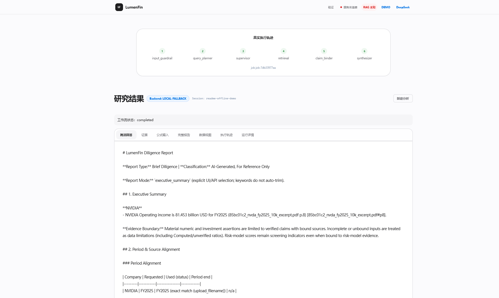

# LumenFin
**上传财报、提出研究问题，得到可对照原文核查的带引用财务回答。**

[English](README.md) | **中文**

LumenFin 是面向财报文档的 Agent：规划任务、在上传文件范围内检索、
用明确输入计算比率、把主张绑定到证据，再输出带引用和审计轨迹的回答。
[FinAgentBench](https://github.com/majiali423/finagentbench-demo)
是配套评测仓，负责回放导出的 FinRun。

[](https://github.com/majiali423/lumenfin-agent/actions/workflows/ci.yml)

徽章反映默认分支上最新一次 GitHub 工作流，不能代表尚未推送的本地改动。
最近一次已发布的 `main` 运行因跨平台 HTML 哈希不一致，在 Offline
regression 失败
（[34691494024](https://github.com/majiali423/lumenfin-agent/actions/runs/34691494024)）。
更早的绿灯
（[34340156893](https://github.com/majiali423/lumenfin-agent/actions/runs/34340156893)）
是历史记录，不能说明当前提交。

[离线运行](#离线运行) · [三个可核查案例](#三个可核查案例) ·
[代码入口](#一条回答如何产生) ·
[评测说明](docs/evaluation_strategy.md) · [文档索引](docs/README.md)

## 一次运行长什么样

已提交的演示路径是真实 API 与 UI，使用**基于规则的回退 LLM** 和确定性检索。
它展示执行与引用行为，不是在线模型的回答质量。


一个与 Agent 输出无关的原文事实：上传
[`nvda_fy2025_10k_excerpt.pdf`](tests/fixtures/sec/derived/nvda_fy2025_10k_excerpt.pdf)，
询问 NVIDIA FY2025 营业利润。节选第 1 页写的是 **81,453 USD millions**，
预期回答为 **81.453 billion USD**。
[人工核对的 gold](tests/fixtures/sec/nvda_fy2025_operating_income_gold.json)
同时记录文件 hash、原始单位、财年和页码。

同一离线服务上完成该任务的界面截图：



截图来自 `scripts/start_offline_demo_api.py`（规则回退）。
该节选的 gold 页码是第 1 页；这份 8 页派生 PDF 会重复同一事实，所以这次离线检索引用了 `#p8`。
这是实际离线运行结果，不是在线模型分数，也不是完整 10-K。

这些 PDF/HTML 是**最小化派生夹具**，不是完整官方 10-K。

## 三个可核查案例

| 案例 | 输入 | 预期行为 | 核对入口 |
|---|---|---|---|
| 正常事实回答 | NVIDIA FY2025 节选 + 营业利润问题 | 回答 **81.453 billion USD** 并引用第 1 页，而不是样例库 72.4 | 上面的 gold JSON；目录 `dt-p01-nvda-oi` |
| 公司不匹配 | 仍是 NVIDIA 文件，问题问 **Apple** FY2025 营业利润 | 说明材料不足以回答 Apple，不得用 NVIDIA 81.453 顶替 | 目录 `dt-p14-aapl-not-in-nvda-file` |
| 不同财年比较 | Microsoft FY2024 节选 + NVIDIA FY2025 节选，比较研发支出 | 分别保留 **Microsoft FY2024 29.51 billion** 与 **NVIDIA FY2025 12.914 billion** | 目录 `dt-p15-msft-vs-nvda-rd` |

24 题开发目录见
[`lumenfin_document_tasks_v1.json`](tests/fixtures/document_tasks/lumenfin_document_tasks_v1.json)。
这是开发诊断用的候选 gold，不是正式准确率。

## 一条回答如何产生

```text
问题 + 上传文件
  → 输入检查 → Planner → TaskSpec
      ├─ 信息不完整 → 保存澄清检查点 → 补充后重新规划
      └─ 在文档 / 公司 / 租户范围内检索
           ├─ 必需财务输入缺失 → 说明数据缺口
           └─ 按需计算 → 风险分析 → Critic / 有界纠正
  → 主张与证据绑定 → 生成回答、引用及审计产物
  → 导出 FinRun → 按需由 FinAgentBench 回放或执行 CI 门禁
```

| 决策 | 作用 | 代码 |
|---|---|---|
| 先规划再选工具 | 盈利比较需要结构化字段；已有证据的风险题不应因缺少无关比率失败 | [`graph.py`](src/lumenfin/graph.py)、[`task_spec.py`](src/lumenfin/task_spec.py) |
| 检索时保留财务身份 | 公司、期间、单位和页码随证据传递；问句点名的发行人始终是主体 | [`chunking.py`](src/lumenfin/rag/chunking.py)、[`hybrid_retriever.py`](src/lumenfin/rag/hybrid_retriever.py)、[`query_focus.py`](src/lumenfin/query_focus.py) |
| 用明确输入计算 | 受限算术；流畅句子不能发明分母 | [`quantitative.py`](src/lumenfin/agents/quantitative.py)、[`safe_formula.py`](src/lumenfin/safe_formula.py) |
| 生成前绑定主张 | 主体、指标、数值、期间和引用在合成前检查 | [`claims/binding.py`](src/lumenfin/claims/binding.py)、[`synthesis.py`](src/lumenfin/agents/synthesis.py) |
| 把分析当成可恢复任务 | 至少一次交付；过期 worker 不得覆盖他人运行 | [`worker.py`](src/lumenfin/worker.py)、[`queueing.py`](src/lumenfin/queueing.py) |

只有 NVIDIA 材料时询问 Apple 营业利润，不得用 NVIDIA 数字顶替。
比较 Microsoft FY2024 与 NVIDIA FY2025 研发支出时，两侧字段期间都要保留。
这些错误来自 24 题诊断，已在产品代码中修复；不能再用后续 live 分数代替根因说明。

架构取舍见 [ARCHITECTURE.md](docs/ARCHITECTURE.md) 与
[设计决策](docs/architecture_decisions.md)。

## 离线运行

使用 **Python 3.12** 和源码检出。这条路径不需要 API key。

```bash
git clone https://github.com/majiali423/lumenfin-agent.git
cd lumenfin-agent
python -m venv .venv
```

PowerShell 激活：`.\.venv\Scripts\Activate.ps1`。
POSIX 激活：`source .venv/bin/activate`。

```bash
python -m pip install -r requirements-lock.txt
python -m pip install -e . --no-deps
python -m pip check
python scripts/start_offline_demo_api.py
```

打开 **http://127.0.0.1:8000/**，上传上面的 NVIDIA 节选，输入：

> Using uploaded files only, what is NVIDIA FY2025 operating income from the filing facts?

再用 [`nvda_narrative_only.txt`](tests/fixtures/sec/minimal/nvda_narrative_only.txt)
问同一问题，观察缺数路径。

离线配置使用**基于规则的回退客户端**和确定性数据提供者。
它展示执行、引用和拒答行为，不能当作在线模型效果。

终端演示：`python scripts/run_portfolio_demo.py`（同样是规则回退）。
完整说明见 [演示指南](docs/DEMO_GUIDE.md) 和
[90 秒展示脚本](docs/AUTUMN_RECRUITING_DEMO_SCRIPT.md)。

## 评测结论（短）

两个问题分开回答：

- **实现是否遵守契约？** CI 覆盖文档、Fast、完整独立回归、产品 v3 闭环和冻结 FinRun 兼容性。
  产品质量和两条冻结契约车道已在 GitHub 上对评分器 pin `40f7599` 通过。
  这不表示当前未推送工作树已经远程全绿。
- **用户任务是否答对且证据成立？**
  产品由 LumenFin 执行；FinAgentBench 检查导出一致性（A 层）；
  独立目录对照原文事实（B 层）。接入策略 `lumenfin_eval_contract.v1`
  把这两层分开。`diagnostic_pass` 只表示 gold；`eval_acceptance_v1`
  是开发验收字段。两者都不是正式准确率。

24 题是开发诊断：派生摘录、重复页应力夹具、lexical + 确定性检索。
不要把 17/24、B1 13/24 一类 live 计数写成准确率。
已授权的 `fair_v2`/`v3`/`v4` 账本、预算和 p24 评分疑点留在
[评测方案](docs/evaluation_strategy.md)。
历史实验见 [证据索引](docs/EVIDENCE_INDEX.md)。

```bash
python scripts/run_tests.py --fast
python scripts/run_tests.py --skip-joint
python scripts/check_doc_links.py
```

[复现说明](docs/REPRODUCIBILITY.md) 与
[验证命令](docs/VALIDATION_COMMANDS.md) 覆盖可选基础设施检查。
不要把 LocalFallback 覆盖写成模型准确率。

## 运行范围

UI 通过源码或 Docker 提供。应用检查点覆盖已实现的澄清恢复；
通用的跨进程 LangGraph 节点级重放不在已验证范围内。
有界数据修复已实现，**默认关闭**。
详见 [运行限制](docs/PRODUCTION_LIMITATIONS.md) 与
[租户边界](docs/MULTI_TENANCY_BOUNDARY.md)。

包元数据仍为 `0.1.0rc5`；历史标签 `v0.1.0-rc.5` 早于后续源码修复。
冻结评分器标签与产品 v3 的源码 pin 见 [版本说明](docs/REPRODUCIBILITY.md)。

[MIT 许可证](LICENSE) · [第三方声明](THIRD_PARTY_NOTICES.md)。
财务输出用于研究，需人工复核。
