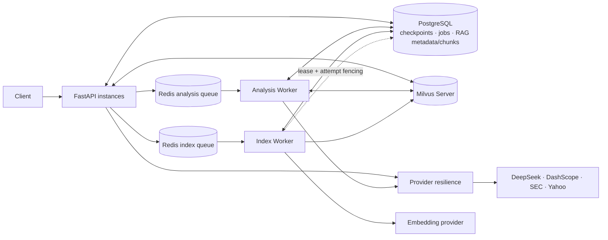

# LumenFin

[English](README.md) | **中文**

**证据锚定的金融研究 Agent，带有显式的 planner–critic–repair 控制流**

由 LangGraph 编排的专职节点（不是彼此独立的自主 Agent）：业务规划 → 检索 →
分析 → 检查 → 修复 → 绑定证据 → 仅综合已验证内容。

[](https://github.com/majiali423/lumenfin-agent/actions/workflows/ci.yml)

Python 3.12 · FastAPI · LangGraph · PostgreSQL · Redis · Milvus ·
Docker Compose · pytest

当前发布候选 **`0.1.0rc3`** · FinRun schema `1.0` · FinAgentBench 评测器
pin **`v0.1.0-rc.3`** · 最终收口 commit/tag 尚未创建 · **作品集发布候选**，
不是“无限制生产就绪”认证
（[局限说明](docs/PRODUCTION_LIMITATIONS.md)）

[文档](docs/README.md) · [架构](docs/FINAL_ARCHITECTURE.md) ·
[局限](docs/PRODUCTION_LIMITATIONS.md) · [演示](docs/DEMO_GUIDE.md) ·
[发布报告](docs/PORTFOLIO_RELEASE_REPORT.md)

---

## 它解决什么问题

常见金融 RAG demo 往往会：

- 把 10-K 正文中的 peer 公司误提升为发行人范围；
- 在没有结构化输入时编造比率；
- 输出流畅但无引用的主张；
- 只看最终段落时看起来“正确”。

LumenFin 让这些失败模式变得**可见**，并以 **fail-closed** 方式处理：规划任务、
获取证据、运行专职分析节点、审计完整性、在有界重试环中修复、将主张绑定到证据，
并在缺少 fundamentals 时拒绝给出无支撑的数值结论。

---

## 一键离线演示

确定性 · 离线 · 无需 API key · 失败时非零退出。

```powershell
python scripts/run_portfolio_demo.py
```

| Demo | 本轮断言内容 |
|------|-----------------------|
| **A** 可信正常分析 | 仅发行人范围、带引用的落地主张、可导出 FinRun 的状态 |
| **B** 隔离与错误检出 | Apple/Microsoft 保持在范围内；错误数值 / 错误实体 / 缺失引用 / 缺失风险均被拒绝（**4/4**） |
| **C** Fail-closed | 强制缺失 SEC + Yahoo → `workflow_status = incomplete_data`，零数值主张 |

该入口还会**打印**离线不复证的已验证引用（Phase 3.2B 租户泄漏 `0`、Phase 3.3A
Docker run id）；本入口不会启动 Docker 栈。完整走读：
[docs/DEMO_GUIDE.md](docs/DEMO_GUIDE.md)

### 已验证 claim 长什么样

已验证公式 Claim 的精简结构示例（ID 与绑定规则与 `src/lumenfin/claims.py`
一致；完整示例见
[docs/examples/verified_formula_claim.json](docs/examples/verified_formula_claim.json)）：

```json
{
  "claim_id": "cl_num_Apple_ebitda_margin",
  "entity": "Apple",
  "claim_type": "numeric",
  "statement": "Apple EBITDA margin is 34.8% for FY2025.",
  "value": 0.3478, "unit": "ratio", "period": "FY2025",
  "metric_name": "ebitda_margin",
  "evidence_refs": [
    {
      "evidence_id": "ev_fund_Apple_ebitda_FY2025",
      "citation": "lumenfin:sec_companyfacts:Apple:FY2025:ebitda",
      "source_type": "sec_companyfacts", "period": "FY2025"
    },
    {
      "evidence_id": "ev_fund_Apple_revenue_FY2025",
      "citation": "lumenfin:sec_companyfacts:Apple:FY2025:revenue",
      "source_type": "sec_companyfacts", "period": "FY2025"
    }
  ],
  "verification": "verified",
  "verify_reason": "Metric/period/unit-bound evidence (formula_inputs_bound); formula_inputs={'ebitda': 'ev_fund_Apple_ebitda_FY2025', 'revenue': 'ev_fund_Apple_revenue_FY2025'}"
}
```

`ebitda_margin` 是公式 Claim：必须同时绑定 `ebitda` 与 `revenue` 两条
fundamentals 证据（见 `claims.py` 的 `FORMULA_INPUTS`），不能写成缺少 metric 的
`ev_fund_{company}_{period}`。

当没有 AST 可计算的 fundamentals 时，同一流水线会发出数据受限主张，而不是编造比率
（完整形状见
[docs/examples/fail_closed_data_limitation_claim.json](docs/examples/fail_closed_data_limitation_claim.json)）：

```json
{
  "claim_id": "cl_risk_OpenAI_supply",
  "entity": "OpenAI",
  "claim_type": "risk_conclusion",
  "statement": "OpenAI data-limitation risk is elevated: no AST-computable fundamentals (structured_source=none).",
  "value": "elevated",
  "metric_name": "data_limitation_risk",
  "evidence_refs": [{
    "evidence_id": "ev_gap_OpenAI",
    "citation": "lumenfin:data_gap:OpenAI:none",
    "source_type": "data_gap"
  }],
  "verification": "verified",
  "verify_reason": "Fail-closed data-limitation risk bound to structured_source=none provenance."
}
```

---

## Agent 控制流

实现：`src/lumenfin/graph.py` 中的 **LangGraph 状态机**专职节点。节点共享同一个
`FinanceState`；它们不是独立的多智能体动作循环。


| Phase | Nodes | Responsibility |
|-------|--------|----------------|
| Plan | `input_guardrail`, `query_planner`, `supervisor` | 输入防护、意图/实体规划、澄清、执行计划 |
| Acquire | `retrieval`, `appendix_replan` | 文档/provider 落地与补充证据 |
| Analyze | `quant`, `psychologist` | AST-safe 财务计算与管理层情绪分析 |
| Validate and repair | `critic`, `repair`, `claim_binder` | 完整性检查、定向重跑、Claim–Evidence Binding |
| Publish（图内） | `synthesizer` → `END` | 仅发布已验证报告；LangGraph 在此结束 |
| Evaluate（图外） | FinRun export、FinAgentBench | 运行后产物 + 独立 sibling 评测器 |

路由细节与边条件见 [docs/FINAL_ARCHITECTURE.md](docs/FINAL_ARCHITECTURE.md)。

### Critic vs Repair vs Claim Binder

这三者**不是**同一道门禁。

**Critic** — `deterministic completeness checks + risk/compliance audit`。
检查中间分析是否存在且结构完整（quant 结果、sentiment、风险/合规输出、状态缺口）。
它不是纯 LLM judge。

**Repair** — **evaluator–router–retry** 机制。它**不会**改写最终报告。根据结构化
违规，在 `critic_max_iterations` 限制下路由回 `retrieval` / `quant` /
`psychologist`。只有值得重新检索的违规才会触发昂贵的 retrieval。

**Claim Binder** — 对照证据校验每条可报告事实：实体、指标、数值、单位、期间、
citation / `source_record_id`、公式输入。只有 verified claims 才能进入 synthesizer。

> Critic 校验工作流完整性。  
> Repair 重跑应负责的上游阶段。  
> Claim Binder 校验单条可报告事实。

### Fail-closed 路径

```text
retrieval detects fatal_data_gap
→ skip quant / sentiment / critic loops
→ claim_binder
→ synthesizer
→ workflow_status = incomplete_data
```

原因：没有 AST 可计算 fundamentals 时，Quant 不得编造默认值，Critic/Repair
不得空转循环，Synthesizer 不得伪造比率。

> Fail-closed 表示系统拒绝无支撑的数值结论。  
> 它并不证明每个被接受的上游来源在全世界范围内都正确。

---

## 证据 / 信任链

```text
PDF / SEC / Yahoo / market providers
→ normalized fundamentals and provenance
→ AST-safe calculations
→ typed claims
→ entity / metric / value / unit / period / citation binding
→ verified claims only
→ report + FinRun
→ independent replay evaluation
```

- RAG 证据**不**自动等同于结构化 fundamentals。
- 流畅句子**不**自动等同于已验证 Claim。

---

## LLM 与确定性职责划分

| Concern | LLM-assisted | Deterministic / programmatic |
|---------|--------------|------------------------------|
| Query understanding | 意图/实体抽取兜底 | 必填字段与澄清路由 |
| Retrieval | 查询措辞与 profile 生成 | provider 顺序、发行人范围、租户过滤 |
| Financial calculations | 无算术权威 | 基于结构化输入的 AST-safe 公式 |
| Critic | 简短合规叙述 | 违规码与修复路由 |
| Evidence verification | 无最终权威 | 实体/数值/单位/期间/引用匹配 |
| Report generation | 语言综合 | 仅 verified claims 可进入报告 |
| Evaluation | 可选语义 judge | 先回放的确定性门禁 |

系统在语言有帮助处使用 LLM；**不会**把 Claim Binder 当作绝对世界真相证明。

---

## 工程可靠性

| Concern | Design |
|---------|--------|
| Persistence | PostgreSQL-first（SQLite 仅用于 `test` / 显式开发 opt-in） |
| Queues | Redis pending → processing → dead-letter；可在无需人工重投的情况下回收 |
| Workers | **Analysis Worker**（`src/lumenfin/worker.py`）消费 analysis 队列；**Index Worker**（`scripts/run_rag_index_worker.py`）消费 index 队列，并带 lease + attempt fencing |
| Providers | 单一重试所有者、deadline、Retry-After、jitter、降级兜底、per-process bulkhead |
| Tenancy | RAG 数据面租户感知的逻辑隔离（[boundary](docs/MULTI_TENANCY_BOUNDARY.md)） |

---

## 已验证结果（分门禁）

**不要**把这些合并成一个“准确率”数字。

| Gate | What it measures | Result |
|------|------------------|--------|
| **LumenFin unit regression** | Linux 最终镜像全量 Python 测试 | **495 passed, 2 skipped** |
| **FinAgentBench unit regression** | 全量 Python 测试 | **149 passed** |
| **Infrastructure integration** | Phase 3.2B 多进程 Docker | **PASS**（`20260804T095357Z`） |
| Worker-kill recovery | 被杀 worker 的任务是否需要人工重投？ | **否** — lease 过期 + attempt fencing 自动回收 |
| Tenant leakage | 跨租户 RAG 读取 | **0** |
| Orphan chunks / vectors | Index 补偿 | **0 / 0** |
| **Provider fault validation** | Phase 3.3A + Docker 双 API | **PASS**（`docker_20260804T100817Z`） |
| Retry amplification across 2 API containers | 逻辑 provider 调用 → 物理 HTTP 尝试 | **20 → 25**（1.25×）；stub 精确观测到 **25** |
| Provider unexpected failures | Scenario G | **0** |
| **Benchmark reliability** | FinAgentBench 完成案例均分 | **92.97**（informational；在评测器 pin `v0.1.0-rc.1` 下测得） |
| Core mutation detection | 错误实体 / 数值 / 引用 / 风险 | **4/4** |
| **Evaluator compatibility** | 冻结 FinRun 导出由 FinAgentBench `v0.1.0-rc.3` 回放 | **PASS**（schema `1.0`；评测器侧 core **4/4** 与 extended provenance/period **7/7**） |
| **Native BM25 + Qwen3** | 合成 hard negative、首次检索一致性、telemetry | **PASS**（Qwen3 Top-1/MRR `1.0/1.0`，零 fallback） |
| **Production hardening** | 不可变镜像、UID 10001、readiness、持久化、备份、密钥扫描、优雅停止 | 受控本地 Compose **PASS** |

当前单元回归计数来自 2026-08-12 Phase 6 的有意未提交工作树。LumenFin
通过最终 UID-10001 Linux 镜像中的 `scripts/run_tests.py` 运行；
FinAgentBench 使用 unittest discovery。直接调用 `pytest` 可能按 subtest
产生不同计数，因此不能混用 runner 总数。

Benchmark 行仅供参考，是在更早的评测器 pin 下测得；**不是**已发布
`v0.1.0-rc.3` 评测器给出的分数。当前 pin 验证的是兼容性：冻结 FinRun 导出可被
FinAgentBench `v0.1.0-rc.3` 接受并回放。

证据：[PHASE32B](docs/PHASE32B_INTEGRATION_REPORT.md) ·
[PHASE33A](docs/PHASE33A_PROVIDER_RESILIENCE_REPORT.md) ·
[Phase 6 full validation](reports/current/PHASE6_FULL_VALIDATION_REPORT.md) ·
[RC reliability](reports/current/LumenFin_RC_Final_Reliability_Report.md) ·
[Compatibility](reports/current/Joint_Compatibility_Report.md)

---

## 运行时拓扑

PostgreSQL、Redis 与 Milvus 是**不同角色**，不是单一管道。
API ↔ PostgreSQL / Milvus 是双向请求路径，而不是只存在
`API → DB → Redis → Worker → Milvus`。



- Analysis 队列与 Index 队列是**不同的** Redis 队列（均为 **at-least-once**，不是 exactly-once）
- Analysis Worker：围绕 `run_job()` 的 reserve / ACK / retry / DLQ
- Index Worker：PostgreSQL lease + attempt fencing 可恢复被杀 worker
- Bulkhead 是 **per-process**，不是跨进程全局限流
- Provider HTTP retry ≠ Redis job retry ≠ appendix replan（不同层级）

完整拓扑说明见 [docs/FINAL_ARCHITECTURE.md](docs/FINAL_ARCHITECTURE.md)。

---

## 设计取舍

- **At-least-once 队列 + fencing，而不是 exactly-once。** 分布式 exactly-once
  交付需要更重的协调；PostgreSQL lease 与 attempt fencing 让重投安全，因此被杀
  worker 无需人工介入即可恢复。
- **有界 repair，而不是开放式自我修正。** `critic_max_iterations` 限制循环，且
  只有值得重新检索的违规码才会重跑昂贵的 retrieval —— 无界 critic 循环只会消耗
  provider 预算。
- **Fail-closed，而不是看起来体面的默认值。** 缺少 fundamentals 时返回
  `incomplete_data` 与数据受限主张，而不是一个看似合理的比率；错误数字在这里比
  缺失数字更贵。
- **先做逻辑租户隔离。** RAG 数据面已按租户隔离，但尚未绑定身份；下一步是
  JWT/API-key 派生的租户声明与 checkpoint/job 作用域
  （[boundary](docs/MULTI_TENANCY_BOUNDARY.md)）。

---

## 快速开始

受支持的 CI Python：**3.12**。优先使用 lockfile 路径。

```powershell
python -m venv .venv
.\.venv\Scripts\python -m pip install -r requirements-lock.txt
.\.venv\Scripts\python -m pip install -e . --no-deps
copy .env.example .env

# 单元套件使用 SQLite test backend。.env.example 默认 APP_ENV=dev，
# 该模式以 PostgreSQL 为主，并默认拒绝 SQLite。
$env:APP_ENV = "test"
.\.venv\Scripts\python scripts\run_tests.py
.\.venv\Scripts\python scripts\run_portfolio_demo.py
```

启动 API（读取 `.env`，默认 `127.0.0.1:8000`）：

```powershell
.\.venv\Scripts\python start_api.py
```

Live provider 需要把密钥放进 `.env`（切勿提交）。配置说明：
[docs/CONFIGURATION.md](docs/CONFIGURATION.md) · 复现冻结证据：
[docs/REPRODUCIBILITY.md](docs/REPRODUCIBILITY.md)。

### 独立评测

评测器位于独立仓库，且不会 import LumenFin 的 app 层。可从 FinAgentBench 侧
对照已发布 tag **`v0.1.0-rc.3`** 复现兼容性门禁
（[majiali423/finagentbench-demo](https://github.com/majiali423/finagentbench-demo)）：

```powershell
git clone --branch v0.1.0-rc.3 https://github.com/majiali423/finagentbench-demo.git
cd finagentbench-demo
python -m pip install -e .
$env:LUMENFIN_ROOT = "<path to lumenfin-agent>"
python scripts\validate_cross_repo.py --profile ci
```

摘要会记录双方 commit、双方 worktree 状态、FinRun schema、profile，以及
core / extended mutation 结果。LumenFin CI 也会在 pin 的评测器 tag 上运行该门禁；
pin 可通过 workflow dispatch 配置。

---

## 局限

以上验证结果产生于受控的多进程与确定性故障注入条件，而非持续生产流量。

- 作品集 RC / 受控部署候选 — **不是**无限制生产就绪
- At-least-once 队列 — **不是** exactly-once
- Per-process bulkhead — **不是**跨进程全局限流
- DeepSeek、DashScope embedding 与 Qwen3 rerank 的受控合成 live smoke 已通过；
  两仓库 Phase 6 本地全量门禁均已通过
- Clean commit/tag RC 验证与远端 CI 仍属于 Phase 7 边界
- 不构成投资建议；仍需人工财务审阅
- PyMuPDF 许可限制公开图片再分发

全文：[docs/PRODUCTION_LIMITATIONS.md](docs/PRODUCTION_LIMITATIONS.md)

---

## 文档地图

| Doc | Purpose |
|-----|---------|
| [docs/README.md](docs/README.md) | 文档索引 |
| [docs/FINAL_ARCHITECTURE.md](docs/FINAL_ARCHITECTURE.md) | Agent 控制流 + 运行时架构 |
| [docs/MULTI_TENANCY_BOUNDARY.md](docs/MULTI_TENANCY_BOUNDARY.md) | 租户隔离范围 |
| [docs/CONFIGURATION.md](docs/CONFIGURATION.md) | 环境变量与 provider pin |
| [docs/REPRODUCIBILITY.md](docs/REPRODUCIBILITY.md) | 复现冻结证据 |
| [docs/DEMO_GUIDE.md](docs/DEMO_GUIDE.md) | 离线演示走读 |
| [docs/PORTFOLIO_RELEASE_REPORT.md](docs/PORTFOLIO_RELEASE_REPORT.md) | 冻结证据 |
| [docs/PHASE32B_INTEGRATION_REPORT.md](docs/PHASE32B_INTEGRATION_REPORT.md) | 多进程 queue/worker 证据 |
| [docs/PHASE33A_PROVIDER_RESILIENCE_REPORT.md](docs/PHASE33A_PROVIDER_RESILIENCE_REPORT.md) | Provider 故障注入证据 |
| [reports/current/Joint_Compatibility_Report.md](reports/current/Joint_Compatibility_Report.md) | LumenFin ↔ FinAgentBench 契约 |
| [CHANGELOG.md](CHANGELOG.md) | 版本历史 |
| [docs/VALIDATION_COMMANDS.md](docs/VALIDATION_COMMANDS.md) | 支持的命令 |

---

## 仓库结构

```text
src/lumenfin/     Agent 运行时、grounding、claims、FinRun、RAG、providers
tests/            离线回归
scripts/          测试、演示、Phase 3.2B/3.3A harness
docs/             架构与发布文档
reports/current/  权威 RC 证据包
```

---

## 许可 / 免责声明

LumenFin 自有源码采用 [MIT License](LICENSE)。第三方依赖和源数据仍适用各自
条款，详见 [THIRD_PARTY_NOTICES.md](THIRD_PARTY_NOTICES.md)。

当前应用镜像包含 PyMuPDF（AGPL-3.0/商业双许可），Compose 还引用 AGPL MinIO
与 source-available Redis 7.4。在相关义务得到解决前，不得把该镜像作为“纯
MIT 制品”公开分发。研究输出仅用于工程评估，**不构成投资建议**。
