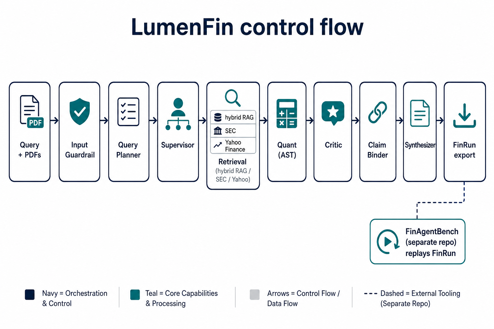
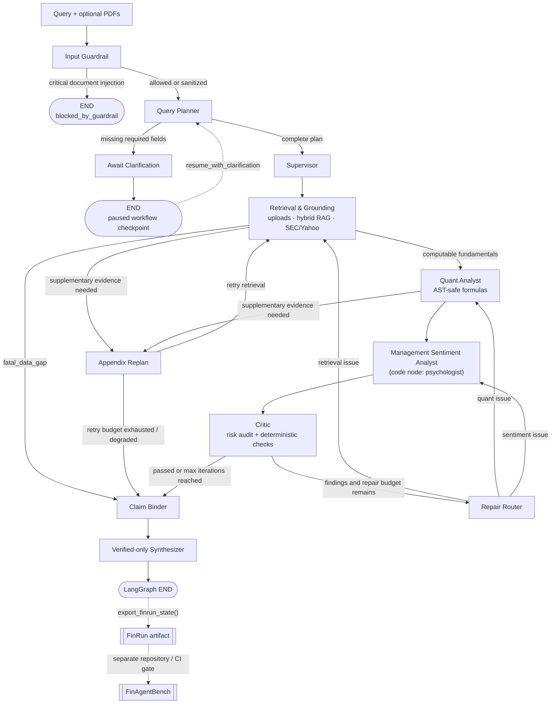
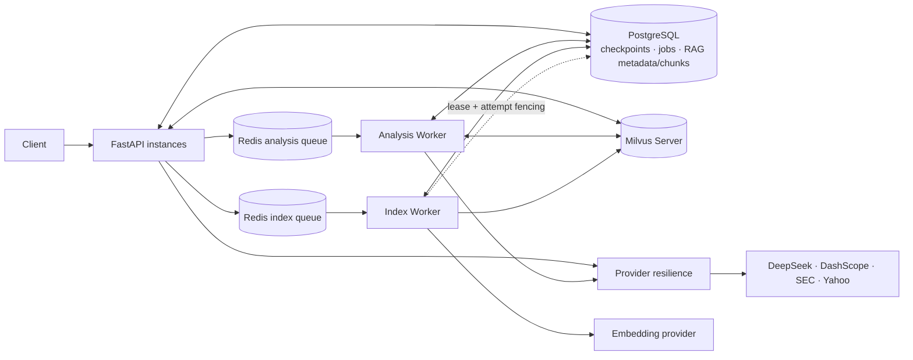

# LumenFin

[English](README.md) | **中文**

证据锚定的金融研究 **Agent 产品**（LangGraph 专职节点，不是彼此独立的多 Agent
集群）。兄弟评测仓
[FinAgentBench](https://github.com/majiali423/finagentbench-demo) 只评
**已导出的 FinRun**。那是作者自有的契约门禁，不是第三方市场榜单，也不是
held-out 产品准确率。

[](https://github.com/majiali423/lumenfin-agent/actions/workflows/ci.yml)

已发布包 **`0.1.0rc5`**（标签 **`v0.1.0-rc.5`**）。FinRun `1.0`。FinAgentBench pin
**`v0.1.0-rc.3`**（required CI 同时对 **`v0.1.0-rc.4`** fail-closed）。

**官方运行时：** GitHub Actions（Ubuntu）与本机 Windows 10/11 上的 Python
**3.12**。classifiers 列出 3.11；required CI 只有 3.12。
**UI：** 源码检出或 Docker（镜像 `COPY static`）。单独
`pip install lumenfin-agent` 的 wheel **不含** 网页。

[局限](docs/PRODUCTION_LIMITATIONS.md) ·
[架构](docs/ARCHITECTURE.md) ·
[5 分钟演示](docs/DEMO_GUIDE.md) ·
[证据索引](docs/EVIDENCE_INDEX.md) ·
[变更摘要](docs/PHASED_CHANGE_SUMMARY.md) ·
[简历草案](docs/RESUME_DRAFT.md)

---

## 具体问题

一段流畅的尽调文字仍然可能：

- 把 10-K 里的 peer 提升成发行人范围；
- 没有结构化输入就编造 EBITDA 利润率；
- 只看最后一段时显得“正确”；
- 正文追加 `999999%`，只核结构化 metric 的评分器仍给满分。

LumenFin 让这些模式 **可见且 fail-closed**：规划 → 检索 → AST 安全量化（当
TaskSpec 要求时）→ critic/repair → 绑定主张 → 只综合已验证事实。缺营收
**不得**单独阻断有证据的 **风险** 回答；它必须阻断 **无证据的数值主张**。

---

## 能看见的结果

离线组合演示（无需 API key）在同一进程里断言三条故事：

| 演示 | 应看到什么 |
|------|------------|
| **A** 正常有证据回答 | 仅发行人范围、公式主张绑定输入、可导出 FinRun |
| **B** 注入错误被抓住 | 错数 / 错主体 / 缺引用 / 缺风险被拒（**本地 claim-binder 4/4**，不是 FinAgentBench 产品准确率） |
| **C** 缺数据局部拒绝 | 强制缺 SEC+Yahoo → `incomplete_data`，**零**编造数值主张 |

网页（源码/Docker）：问题 → **简洁回答** → 证据 id → 公式输入 → **真实**
`audit_log`。进度是 job 轮询，不是 800ms 假节点计时。刷新用 `?job=`。

主张形状（节选；全文见
[docs/examples/verified_formula_claim.json](docs/examples/verified_formula_claim.json)）：

```json
{
  "claim_id": "cl_num_Apple_ebitda_margin",
  "entity": "Apple",
  "claim_type": "numeric",
  "value": 0.3478,
  "unit": "ratio",
  "period": "FY2025",
  "verification": "verified"
}
```

---

## 5 分钟离线复现

需要 **源码检出**（不是只有 wheel）。不要设置 `PYTHON_DOTENV_DISABLED=1`。
不要覆盖已经漂移的旧 `.venv`；若 `pip show lumenfin-agent` 不是
`0.1.0rc5` 或 `pip check` 失败，请另建虚拟环境。

**1. 仅主项目**（不需要 FinAgentBench）。`--fast` 与离线 UI 不导入评测包。

```powershell
python -m venv .venv
.\.venv\Scripts\python -m pip install -r requirements-lock.txt
.\.venv\Scripts\python -m pip install -e . --no-deps
.\.venv\Scripts\python -m pip show lumenfin-agent milvus-lite
.\.venv\Scripts\python -m pip check
copy .env.example .env
$env:APP_ENV = "test"
.\.venv\Scripts\python scripts\run_portfolio_demo.py
.\.venv\Scripts\python scripts\run_tests.py --fast
.\.venv\Scripts\python scripts\start_offline_demo_api.py
```

然后打开 `http://127.0.0.1:8000/`。这条路径不需要 live key。

**首选演示问题**（已验证的上传闭环，NVIDIA FY2025 节选）：

```text
Using uploaded files only, what is NVIDIA FY2025 operating income from the filing facts?
```

上传 `tests/fixtures/sec/derived/nvda_fy2025_10k_excerpt.pdf`。人工 gold：营业利润
**81.453 billion USD**（第 1 页，USD millions）。样例库 NVIDIA 为 72.4，若结果是
72.4 则是回填而非文件。缺字段路径：同一问题上传
`tests/fixtures/sec/minimal/nvda_narrative_only.txt`。

**2. 双仓工作树**（完整测试 + 产品 v3 门禁）。v3 评分器 **还不是已发布 tag**。
指向当前 `finagentbench-demo` 工作树，不要伪造 SHA。

```powershell
$env:FINAGENTBENCH_DIR = "<finagentbench-demo 绝对路径>"
.\.venv\Scripts\python -m pip install -e $env:FINAGENTBENCH_DIR
.\.venv\Scripts\python scripts\run_tests.py --skip-joint
.\.venv\Scripts\python scripts\run_tests.py --joint-only
cd $env:FINAGENTBENCH_DIR
python -m unittest discover -s tests -v
$env:LUMENFIN_ROOT = "<lumenfin-agent 绝对路径>"
python scripts\validate_cross_repo.py --profile ci
```

`validate_cross_repo.py --profile ci` 得 100 是 **冻结样例契约**，不是产品准确率。

**3. 冻结已发布评测器**（仅 FinRun 契约）：

```powershell
git clone --branch v0.1.0-rc.3 https://github.com/majiali423/finagentbench-demo.git
cd finagentbench-demo
python -m pip install -e .
$env:LUMENFIN_ROOT = "<path to lumenfin-agent>"
python scripts\validate_cross_repo.py --profile ci
```

CI 同时对 `v0.1.0-rc.4` fail-closed。必需 job：`offline` 跑 `--skip-joint`；
**Product quality v3** 在 `FINAGENTBENCH_PRODUCT_REF` 为空/默认分支/rc.3/rc.4
时是配置失败，不是跳过成功。发布顺序：评测仓先落地 v3 → 记下 SHA → 设置
LumenFin 仓库变量 → 再依赖该 job。本轮不改远程变量。远程 Actions **未验证**。

---

## 架构取舍（实际做了什么）

- **一张 LangGraph `FinanceState`**，专职 **节点**，不是独立 Agent 网。
  保持 FastAPI + Redis 队列 + Milvus；不再加一层 Agent 框架。
- 作业是 **at-least-once**（reservation token + lease）。不是 exactly-once。
- **HITL** 暂停/恢复用进程内 LangGraph `InMemorySaver`，外加持久化
  `WorkflowCheckpointRepository`。这 **不是** 已测试的跨进程、逐节点
  LangGraph 回放。
- **FinAgentBench 是兄弟包**，FinRun 有版本。不把 4/4、11/11、14/14 说成
  当前页产品准确率。
- **TaskSpec**（默认开）：风险/叙述题不会只因缺 AST 比率而 fail-closed。
  **有界修复** 存在，离线 ablation 后默认 **关**。

---

## 效果、成本、边界

| 种类 | 成立的事实 | 不声称 |
|------|------------|--------|
| 离线 A/B/C | `run_portfolio_demo.py` 必须 exit 0 | 生产 SLA / 用户数 |
| 单测 | 当前 dirty 工作区见 [docs/PHASED_IMPROVEMENT_LOG.md](docs/PHASED_IMPROVEMENT_LOG.md) | 每台电脑干净安装都已测 |
| FinanceBench / LEDGER | 封存的历史 canary；不要重跑 holdout 调参 | 通用问答准确率 |
| product-dev 集 | 36 条手写 gold；只评 **dev**；test 冻结 | 80%/95% 目标 |
| 成本 | 离线演示用 `LocalFallbackLLM`（不耗 token） | 未预算前的 live DeepSeek/SEC/Yahoo 费用 |

已知缺口：保留已漂移的旧 `.venv` 时另建隔离环境核对；远程产品评分 CI
在 `FINAGENTBENCH_PRODUCT_REF` 发布前 **未验证**；pip wheel 无 UI。

封存数字与报告：[docs/EVIDENCE_INDEX.md](docs/EVIDENCE_INDEX.md)。
运维边界：[docs/PRODUCTION_LIMITATIONS.md](docs/PRODUCTION_LIMITATIONS.md)。

---

## 更深文档

| 文档 | 用途 |
|------|------|
| [docs/README.md](docs/README.md) | 文档地图 |
| [docs/ARCHITECTURE.md](docs/ARCHITECTURE.md) | Graph、worker、checkpoint |
| [docs/PHASED_CHANGE_SUMMARY.md](docs/PHASED_CHANGE_SUMMARY.md) | Phase 0–6：发现的缺陷与改动 |
| [docs/RESUME_DRAFT.md](docs/RESUME_DRAFT.md) | 诚实简历条目 |
| [docs/EVIDENCE_INDEX.md](docs/EVIDENCE_INDEX.md) | 历史分数、hash、报告（不删原件） |

---

## Agent 控制流

实现：`src/lumenfin/graph.py` 中的 **LangGraph 状态机**专职节点。节点共享同一个
`FinanceState`；它们不是独立的多智能体动作循环。





| Phase | Nodes | Responsibility |
|-------|--------|----------------|
| Plan | `input_guardrail`, `query_planner`, `supervisor` | 输入防护、意图/实体规划、澄清、执行计划 |
| Acquire | `retrieval`, `appendix_replan` | 文档/provider 落地与补充证据 |
| Analyze | `quant`, `psychologist` | AST-safe 财务计算与管理层情绪分析 |
| Validate and repair | `critic`, `repair`, `claim_binder` | 完整性检查、定向重跑、Claim–Evidence Binding |
| Publish（图内） | `synthesizer` → `END` | 仅发布已验证报告；LangGraph 在此结束 |
| Evaluate（图外） | FinRun export、FinAgentBench、可选 FinanceBench/LEDGER | 回放评测器 + 已封存 RAG canary（不是产品准确率） |

路由细节与边条件见 [docs/ARCHITECTURE.md](docs/ARCHITECTURE.md)。

### Critic vs Repair vs Claim Binder

这三者**不是**同一道门禁。

**Critic** — `deterministic completeness checks + risk/compliance audit`。
检查中间分析是否存在且结构完整（quant 结果、sentiment、风险/合规输出、状态缺口）。
它不是纯 LLM judge。

**Repair** — **evaluator–router–retry** 机制。它**不会**改写最终报告。根据结构化
违规，在 `critic_max_iterations` 限制下路由回 `retrieval` / `quant` /
`psychologist`。只有值得重新检索的违规才会触发昂贵的 retrieval。

**Claim Binder** — 对照证据校验每条可报告事实：实体、指标、数值、单位、期间、
citation / `source_record_id`、公式输入。只有 verified claims 才能进入 synthesizer。

> Critic 校验工作流完整性。  
> Repair 重跑应负责的上游阶段。  
> Claim Binder 校验单条可报告事实。

### Fail-closed 路径

```text
retrieval detects fatal_data_gap
→ skip quant / sentiment / critic loops
→ claim_binder
→ synthesizer
→ workflow_status = incomplete_data
```

原因：没有 AST 可计算 fundamentals 时，Quant 不得编造默认值，Critic/Repair
不得空转循环，Synthesizer 不得伪造比率。

> Fail-closed 表示系统拒绝无支撑的数值结论。  
> 它并不证明每个被接受的上游来源在全世界范围内都正确。

---

## 证据 / 信任链

```text
PDF / SEC / Yahoo / market providers
→ normalized fundamentals and provenance
→ AST-safe calculations
→ typed claims
→ entity / metric / value / unit / period / citation binding
→ verified claims only
→ report + FinRun
→ independent replay evaluation
```

- RAG 证据**不**自动等同于结构化 fundamentals。
- 流畅句子**不**自动等同于已验证 Claim。

---

## LLM 与确定性职责划分

| Concern | LLM-assisted | Deterministic / programmatic |
|---------|--------------|------------------------------|
| Query understanding | 意图/实体抽取兜底 | 必填字段与澄清路由 |
| Retrieval | 查询措辞与 profile 生成 | provider 顺序、发行人范围、租户过滤 |
| Financial calculations | 无算术权威 | 基于结构化输入的 AST-safe 公式 |
| Critic | 简短合规叙述 | 违规码与修复路由 |
| Evidence verification | 无最终权威 | 实体/数值/单位/期间/引用匹配 |
| Report generation | 语言综合 | 仅 verified claims 可进入报告 |
| Evaluation | 可选语义 judge | 先回放的确定性门禁 |

系统在语言有帮助处使用 LLM；**不会**把 Claim Binder 当作绝对世界真相证明。

---

## 工程可靠性

| Concern | Design |
|---------|--------|
| Persistence | PostgreSQL-first（SQLite 仅用于 `test` / 显式开发 opt-in） |
| Queues | Redis pending → processing → dead-letter；可在无需人工重投的情况下回收 |
| Workers | **Analysis Worker**（`src/lumenfin/worker.py`）消费 analysis 队列；**Index Worker**（`scripts/run_rag_index_worker.py`）消费 index 队列，并带 lease + attempt fencing |
| Providers | 单一重试所有者、deadline、Retry-After、jitter、降级兜底、per-process bulkhead |
| Tenancy | API key 绑定服务端 principal；jobs、checkpoints 与 RAG 查询均按授权租户隔离（[boundary](docs/MULTI_TENANCY_BOUNDARY.md)） |

---

## 历史门禁（索引）

带日期的快照（含 2026-08-13 post-rc4 快照）与封存检索分数见
[docs/EVIDENCE_INDEX.md](docs/EVIDENCE_INDEX.md)（原报告保留）。
**不要**合成一个准确率。当前 HEAD 以
[ci.yml](https://github.com/majiali423/lumenfin-agent/actions/workflows/ci.yml)
与本地 `python scripts/run_tests.py` 为准。

运维边界：[docs/PRODUCTION_LIMITATIONS.md](docs/PRODUCTION_LIMITATIONS.md)。

---

## 运行时拓扑

PostgreSQL、Redis 与 Milvus 是**不同角色**，不是单一管道。
API ↔ PostgreSQL / Milvus 是双向请求路径，而不是只存在
`API → DB → Redis → Worker → Milvus`。



- Analysis 队列与 Index 队列是**不同的** Redis 队列（均为 **at-least-once**，不是 exactly-once）
- Analysis Worker：围绕 `run_job()` 的 reserve / ACK / retry / DLQ
- Index Worker：PostgreSQL lease + attempt fencing 可恢复被杀 worker
- Bulkhead 是 **per-process**，不是跨进程全局限流
- Provider HTTP retry ≠ Redis job retry ≠ appendix replan（不同层级）

完整拓扑说明见 [docs/ARCHITECTURE.md](docs/ARCHITECTURE.md)。

---

## 设计取舍

- **At-least-once 队列 + fencing，而不是 exactly-once。** 分布式 exactly-once
  交付需要更重的协调；PostgreSQL lease 与 attempt fencing 让重投安全，因此被杀
  worker 无需人工介入即可恢复。
- **有界 repair，而不是无界 critic 循环。** `critic_max_iterations` 限制循环，且
  只有值得重新检索的违规码才会重跑昂贵的 retrieval —— 无界 critic 循环只会消耗
  provider 预算。
- **Fail-closed，而不是看起来体面的默认值。** 缺少 fundamentals 时返回
  `incomplete_data` 与数据受限主张，而不是一个看似合理的比率；错误数字在这里比
  缺失数字更贵。
- **凭据绑定的逻辑租户隔离。** API key 映射到服务端 principal；jobs、checkpoints
  与 RAG 路径均校验授权租户。剩余缺口是外部 IdP/OIDC、RBAC、PostgreSQL RLS
  与按租户物理隔离（[boundary](docs/MULTI_TENANCY_BOUNDARY.md)）。

---

## 局限

以上验证结果产生于受控的多进程与确定性故障注入条件，而非持续生产流量。

- 作品集 RC / 受控部署候选 — **不是**无限制生产就绪认证
- At-least-once 队列 — **不是** exactly-once
- Per-process bulkhead — **不是**跨进程全局限流
- DeepSeek、DashScope embedding 与 Qwen3 rerank 的受控合成 live smoke 已通过；
  两仓库本地全量验证门禁均已通过
- 已发布标签 `v0.1.0-rc.3`，`main` / tag 上 GitHub Actions 为绿；剩余缺口是
  soak、生产 IdP/RBAC/RLS、公开镜像分发 — 不是“尚未打 tag”
- `main` 上的文档可能比不可变 RC tag 超前若干 commit
- 不构成投资建议；仍需人工财务审阅
- PyMuPDF / MinIO 的 AGPL（以及 Redis RSALv2/SSPL）限制公开镜像分发；
  不要把应用镜像表述为纯 MIT 可分发 Docker 产物

全文：[docs/PRODUCTION_LIMITATIONS.md](docs/PRODUCTION_LIMITATIONS.md)

---

## 文档地图

| Doc | Purpose |
|-----|---------|
| [docs/README.md](docs/README.md) | 文档索引 |
| [docs/ARCHITECTURE.md](docs/ARCHITECTURE.md) | Agent 控制流 + 运行时架构 |
| [docs/MULTI_TENANCY_BOUNDARY.md](docs/MULTI_TENANCY_BOUNDARY.md) | 租户隔离范围 |
| [docs/CONFIGURATION.md](docs/CONFIGURATION.md) | 环境变量与 provider pin |
| [docs/REPRODUCIBILITY.md](docs/REPRODUCIBILITY.md) | 复现冻结证据 |
| [docs/DEMO_GUIDE.md](docs/DEMO_GUIDE.md) | 离线演示走读 |
| [docs/PORTFOLIO_RELEASE_REPORT.md](docs/PORTFOLIO_RELEASE_REPORT.md) | 冻结证据 |
| [docs/QUEUE_WORKER_INTEGRATION.md](docs/QUEUE_WORKER_INTEGRATION.md) | 多进程 queue/worker 证据 |
| [docs/PROVIDER_RESILIENCE.md](docs/PROVIDER_RESILIENCE.md) | Provider 故障注入证据 |
| [docs/PRODUCTION_LIMITATIONS.md](docs/PRODUCTION_LIMITATIONS.md) | 受控 RC 边界与已验证门禁摘要 |
| [CHANGELOG.md](CHANGELOG.md) | 版本历史 |
| [docs/VALIDATION_COMMANDS.md](docs/VALIDATION_COMMANDS.md) | 支持的命令 |
| [docs/FINANCEBENCH_EVAL.md](docs/FINANCEBENCH_EVAL.md) | 外部 FinanceBench 页检索（已消耗；Phase 4 `NOT_RUN`） |
| [docs/FINANCEBENCH_NEXT_PHASE.md](docs/FINANCEBENCH_NEXT_PHASE.md) | LEDGER public-dev 已封存停止；生产仍为 A |

---

## 仓库结构

```text
src/lumenfin/           Agent 运行时、grounding、claims、FinRun、RAG、providers
src/lumenfin/eval/      FinanceBench + LEDGER 评测 harness（不改生产 RAG）
tests/                  离线回归
scripts/                测试、演示、worker、已封存评测 runner
docs/                   架构与发布文档
data/eval_rag/          仅跟踪聚合（不含原题或 PDF）
reports/current/        权威 RC 证据包
```

---

## 许可 / 免责声明

LumenFin 自有源码采用 [MIT License](LICENSE)。第三方依赖和源数据仍适用各自
条款，详见 [THIRD_PARTY_NOTICES.md](THIRD_PARTY_NOTICES.md)。

当前应用镜像包含 PyMuPDF（AGPL-3.0/商业双许可），Compose 还引用 AGPL MinIO
与 source-available Redis 7.4。在相关义务得到解决前，不得把该镜像作为“纯
MIT 制品”公开分发。研究输出仅用于工程评估，**不构成投资建议**。
