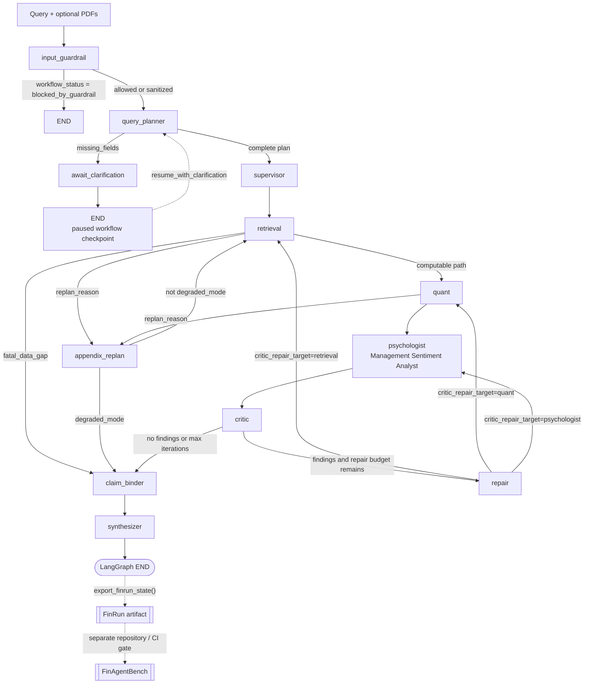
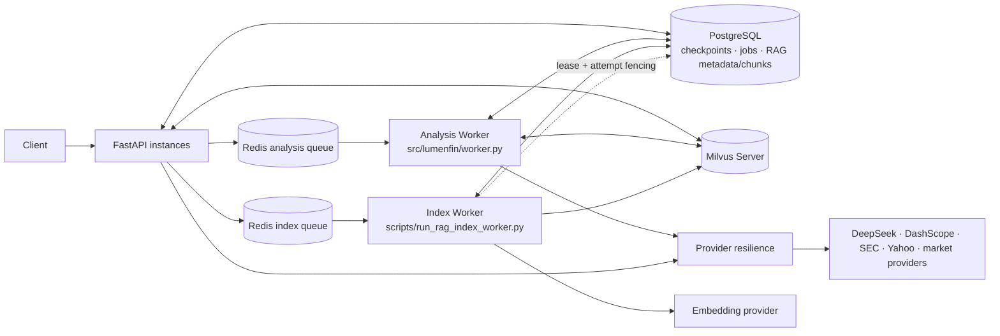

# LumenFin Final Architecture

Trustworthy Financial Research Agent — architecture for current **portfolio
release candidate** `0.1.0rc4` (published tag **`v0.1.0-rc.4`**; FinRun
schema `1.0`, FinAgentBench pin **`v0.1.0-rc.3`**).

LumenFin is a portfolio release candidate validated under controlled
multi-process and deterministic fault-injection conditions. These results
are not a certification of unrestricted production readiness.

---

## 1. System Overview

**LumenFin** is a LangGraph-orchestrated financial research agent implemented as
a **state machine of specialist nodes** (not a society of fully autonomous
agents). It turns a user query (and optional SEC filings / uploads) into a
diligence report that is intended to be **grounded, checkable, and honest when
data is missing**.

| Goal | Meaning in practice |
|------|---------------------|
| Grounded financial analysis | Numbers come from AST-safe formulas over retrieved or SEC/Yahoo fundamentals — not LLM invention |
| Evidence-backed claims | Material assertions are claim objects bound to evidence citations before synthesis |
| Reliable reports | Fail-closed (`incomplete_data`) when fundamentals are absent; issuer isolation against peer pollution |
| Operable runtime | PostgreSQL + Redis reliable queues + Milvus Server + provider resilience under multi-process stress |

**Sibling evaluator:** [FinAgentBench](https://github.com/majiali423/finagentbench-demo)
scores exported `FinRun` traces. Recommended published tag: **`v0.1.0-rc.3`**
(local sibling checkout optional for offline demos). LumenFin generates;
FinAgentBench gates reliability.

Canonical path:

```text
LumenFin run → export_finrun_state() → FinAgentBench (ci / regression)
```

---

## 2. Conceptual evidence path

Keep this as the product trust story (orthogonal to node names):

```text
Query / PDF
→ LangGraph specialist orchestration
→ SEC / Yahoo / hybrid RAG
→ structured financial grounding
→ claim builder
→ evidence binder
→ verified-only synthesis
→ FinRun
→ FinAgentBench
```

```text
User Query (+ optional PDFs)
        ↓
Agent Orchestration (LangGraph state machine)
  input_guardrail → query_planner → (HITL clarify?) → supervisor
        ↓
Research / Retrieval / Tool Layer
  upload parse · Milvus hybrid RAG · market snapshot · tools
        ↓
Financial Grounding Layer
  issuer-only SEC / Yahoo gap-fill when uploads are not AST-computable
        ↓
Claim Builder + Evidence Binding
  claim_binder: numeric / risk / investment claims → structural verify
        ↓
Report Synthesizer (verified claims only)
        ↓
LangGraph END
        ↓
(post-graph) FinRun Export → FinAgentBench Evaluation
```

### Module responsibilities

| Layer | Responsibility |
|-------|----------------|
| **Agent orchestration** | Explicit LangGraph nodes with `audit_log`; conditional edges for repair, appendix replan, HITL pause |
| **Research / retrieval / tools** | PDF/HTML chunking, Milvus dense + native BM25 weighted RRF, optional Qwen3 rerank (`filename#pN`), ticker resolve, market providers |
| **Financial grounding** | Issuer fundamentals from SEC companyfacts / Yahoo when AST coverage is incomplete |
| **Claim builder** | Typed claim objects from quant / risk / report context |
| **Evidence binding** | Structural verify; reject unbound inventable numerics under fail-closed |
| **Report synthesizer** | Markdown from verified claims + ledger; disclose limitations |
| **FinRun export** | Framework-independent evaluation artifact |
| **FinAgentBench** | Replay-first scoring; CI gate without calling the agent runtime |

---

## 3. Agent control flow (code truth)

Source of truth: `src/lumenfin/graph.py`
(`LumenFinAgentSystem._build_graph()` and `route_after_*`).

### Nodes

| Code node | External label | Role |
|-----------|----------------|------|
| `input_guardrail` | Input Guardrail | Block or sanitize risky document injection |
| `query_planner` | Query Planner | Intent/entities/required fields |
| `await_clarification` | HITL Clarification | Pause when fields missing (`→ END`) |
| `supervisor` | Supervisor | Turn plan into execution handoff |
| `retrieval` | Retrieval & Grounding | Uploads, hybrid RAG, SEC/Yahoo |
| `quant` | Quant Analyst | AST-safe formulas over structured inputs |
| `psychologist` | Management Sentiment Analyst | Management/tone analysis |
| `critic` | Critic | Deterministic completeness + risk/compliance audit |
| `repair` | Repair Router | Route back to retrieval/quant/psychologist |
| `appendix_replan` | Appendix Replan | Plan one supplementary retrieval pass |
| `claim_binder` | Claim Binder | Bind claims to evidence |
| `synthesizer` | Verified-only Synthesizer | Report from verified claims only |

LangGraph registration ends at `synthesizer → END`. **FinRun export** and
**FinAgentBench** are not `workflow.add_node()` targets; they run after the
graph produces a final result (`export_finrun_state()` / sibling CI gate).

### Control-flow diagram



### Conditional routers (summary)

| Router | Condition → next |
|--------|------------------|
| `route_after_input_guardrail` | `blocked_by_guardrail` → `END`; else → `query_planner` |
| `route_after_query_planner` | `missing_fields` → `await_clarification`; else → `supervisor` |
| `route_after_retrieval` | `fatal_data_gap` → `claim_binder`; `replan_reason` → `appendix_replan`; else → `quant` |
| `route_after_quant` | `replan_reason` → `appendix_replan`; else → `psychologist` |
| `route_after_critic` | no findings → `claim_binder`; iterations ≥ `critic_max_iterations` → `claim_binder`; else → `repair` |
| `route_after_repair` | `critic_repair_target` ∈ {`retrieval`, `quant`, `psychologist`} |
| `route_after_appendix_replan` | `degraded_mode` → `claim_binder`; else → `retrieval` |

### Two different loops

**Supplementary evidence loop** (coverage / appendix search):

```text
retrieval / quant → appendix_replan → retrieval
```

- Driven by `replan_reason`, not by Critic violations.
- `appendix_replan` plans a **supplementary retrieval** attempt.
- It is **not** Provider HTTP retry (`call_with_policy` owns HTTP retries).
- When the appendix budget is exhausted, `degraded_mode` routes to
  `claim_binder` instead of looping forever.

**Quality repair loop** (completeness / compliance):

```text
critic → repair → retrieval / quant / psychologist → critic
```

- Driven by `compliance_findings` / `compliance_violations`.
- `repair` only **routes**; it does not rewrite the final report.
- Bounded by `critic_max_iterations` (from `AppConfig`, default on state).
- Retrieval is re-entered only for retrieval-worthy violation codes
  (`RETRIEVAL_WORTHY_CODES`); otherwise repair demotes to a cheaper target.

### Fail-closed (`fatal_data_gap`)

When retrieval finds documents/companies but **no AST-computable fundamentals**:

```text
retrieval → claim_binder → synthesizer
```

Quant, psychologist, critic, and repair are **skipped**. The synthesizer emits
an incomplete / fail-closed narrative (`workflow_status = incomplete_data`)
instead of inventing ratios.

### Checkpointing: two layers

| Mechanism | Role |
|-----------|------|
| LangGraph `InMemorySaver` | In-process graph checkpointer used by `workflow.compile(checkpointer=...)` for thread-local graph progress (including HITL pause/resume within a process) |
| `WorkflowCheckpointRepository` | Persisted workflow checkpoints (PostgreSQL in integration/production paths) for durable run records, CAS revision, and API/worker orchestration |

They are complementary: the graph saver is the LangGraph runtime checkpointer;
the repository is the application persistence model for durable workflow state.
They are **not** the same checkpoint mechanism.

### HITL pause and clarification resume

```text
await_clarification → END
```

Resume is **not** a full re-execution of the `query_planner()` node function as
a fresh graph entry. `LumenFinAgentSystem.resume_with_clarification(...)`:

```text
load graph snapshot (InMemorySaver thread state)
→ merge user clarification into the query
→ rebuild query plan via build_query_plan(...)
→ graph.update_state(..., as_node="query_planner")
→ continue invoke through planner routing
  (missing_fields → await_clarification again, else → supervisor)
```

Durable API/worker paths may also hydrate from `WorkflowCheckpointRepository`
via `bootstrap_thread_from_store` before resume.

---

## 4. Runtime topology

Validated multi-process reference (queue/worker + provider-resilience Docker). Analysis and
index work use **separate** Redis queues:

```text
Analysis queue → Analysis Worker → LumenFinAnalysisService.run_job()
Index queue    → Index Worker    → document indexing / PostgreSQL / Milvus
```



| Component | Role |
|-----------|------|
| **PostgreSQL** | Checkpoints (CAS revision), analysis jobs, RAG metadata/chunks, index leases/attempts |
| **Redis analysis queue** | Reliable pending → processing → DLQ for analysis jobs (`MAS` analysis queue name); Analysis Worker uses reserve / ACK / retry / reclaim (**at-least-once**) |
| **Redis index queue** | Separate reliable queue for RAG indexing; Index Worker uses the same Redis reliability primitives plus PostgreSQL **lease + attempt fencing** |
| **Analysis Worker** | `src/lumenfin/worker.py` → `LumenFinAnalysisService.run_job()` |
| **Index Worker** | `scripts/run_rag_index_worker.py` → embed / upsert / finalize ready or failed |
| **API instances** | Request handlers; process-local HTTP clients and bulkheads; enqueue jobs; read/write PG and query Milvus |
| **Milvus Server** | Shared `lumenfin_chunks_v4_bm25` collection: 1024-D dense vectors + native BM25 sparse function; weighted RRF candidates feed Qwen3 rerank. Lite remains local/dev only |

**Layer separation:** provider HTTP retry (`call_with_policy`) ≠ Redis job retry /
reclaim ≠ appendix replan. Bulkheads are **per-process**, not a cross-process
global rate limit.

Production Compose also persists Redis AOF and Milvus's coordinated etcd/MinIO
state, gates API health on PostgreSQL + Redis + the configured Milvus
collection, and runs application processes as UID/GID `10001`.

Local demos may use SQLite + Milvus Lite under `APP_ENV=test` / explicit
`MAS_ALLOW_SQLITE_DEV`. Production/integration **require** PostgreSQL.

---

## 5. Provider reliability

Single retry owner per logical provider call (`call_with_policy`):

- Request-level deadline
- `max_attempts` = total physical attempts
- `Retry-After` honored (bounded)
- Exponential backoff + bounded jitter
- Process-local shared `httpx.Client` (`trust_env=False`)
- Fallback marked `degraded` (does not hide primary failure class)
- Per-process bulkhead (`provider_busy` is not HTTP-retried)
- Deterministic provider stub for provider-resilience suites (no live keys required)

**Note:** per-process bulkhead ≠ cross-process global rate limit.
**Note:** provider HTTP retry ≠ `appendix_replan` supplementary retrieval ≠
Redis job reclaim.

Evidence: [PROVIDER_RESILIENCE.md](PROVIDER_RESILIENCE.md)
(`docker_20260804T100817Z`).

---

## 6. Multi-tenant boundary

Current implementation: **credential-bound logical tenant authorization**.

Covered: API-key-to-principal mapping; request tenant mismatch rejection;
tenant-scoped jobs, checkpoints, and RAG lookups; tenant in document IDs,
PostgreSQL filters, Redis payload, Milvus filters, keyword/hybrid retrieval;
integration leakage = 0.

Not covered: external IdP/OIDC, RBAC, PostgreSQL RLS, per-tenant databases or
vector infrastructure.

Details: [MULTI_TENANCY_BOUNDARY.md](MULTI_TENANCY_BOUNDARY.md).

---

## 7. Data flow (uploaded 10-K)

```text
Document (SEC 10-K PDF / HTML)
        ↓
Parsing (PyMuPDF / HTML extract)
        ↓
Indexing (chunks → PostgreSQL + Milvus; async workers in integration)
        ↓
Financial Facts (document + issuer SEC/Yahoo gap-fill)
        ↓
Retrieval (hybrid RAG + structured company payload)
        ↓
Quant / risk → Claims → Evidence binding → Report
→ (post-graph) FinRun export → FinAgentBench
```

### Important separations

1. **RAG ≠ fundamentals.** Narrative cites ≠ AST-computable structured facts.
2. **Issuer ≠ peer.** Uploads expand `issuer_companies` only.
3. **Claim ≠ sentence.** Fluent text is trusted only when mapped to verified claims.
4. **Provider retry ≠ Redis job retry.** Outer job redelivery is a separate layer.
5. **Critic ≠ Claim Binder.** Completeness/repair routing ≠ per-claim evidence verify.
6. **Appendix replan ≠ Repair.** Coverage supplement ≠ quality repair loop.

---

## 8. Related docs

| Doc | Role |
|-----|------|
| [MULTI_TENANCY_BOUNDARY.md](MULTI_TENANCY_BOUNDARY.md) | Tenant isolation scope |
| [PRODUCTION_LIMITATIONS.md](PRODUCTION_LIMITATIONS.md) | Portfolio RC positioning |
| [QUEUE_WORKER_INTEGRATION.md](QUEUE_WORKER_INTEGRATION.md) | Multi-process infra |
| [PROVIDER_RESILIENCE.md](PROVIDER_RESILIENCE.md) | Provider faults |
| [PORTFOLIO_RELEASE_REPORT.md](PORTFOLIO_RELEASE_REPORT.md) | Release freeze evidence |
| [FINAGENTBENCH_DESIGN.md](FINAGENTBENCH_DESIGN.md) | Evaluation design |
| [CONFIGURATION.md](CONFIGURATION.md) | Env / FinAgentBench pin |
