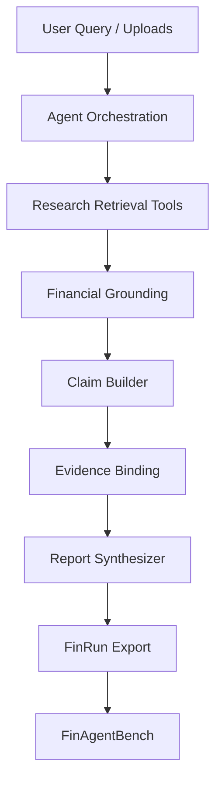

# LumenFin Final Architecture

Trustworthy Financial Research Agent — architecture as of Release Candidate Validation (PASS).

This document describes **what the system is**, not a feature roadmap.

Release contract: LumenFin `0.1.0rc1` → FinRun schema `1.0` →
FinAgentBench `0.1.0rc1` (`v0.1.0-rc.1`).

---

## 1. System Overview

**LumenFin** is a LangGraph-orchestrated financial research agent. It turns a user query (and optional SEC filings / uploads) into a diligence report that is intended to be **grounded, checkable, and honest when data is missing**.

It is not optimized for fluent chat. The product goal is:

| Goal | Meaning in practice |
|------|---------------------|
| Grounded financial analysis | Numbers come from AST-safe formulas over retrieved or SEC/Yahoo fundamentals — not LLM invention |
| Evidence-backed claims | Material assertions are claim objects bound to evidence citations before synthesis |
| Reliable reports | Fail-closed (`incomplete_data`) when fundamentals are absent; issuer isolation against peer pollution |

**Sibling project:** [FinAgentBench](../../finagentbench-demo) evaluates exported `FinRun` traces. LumenFin generates; FinAgentBench gates reliability.

Canonical path:

```text
LumenFin run → export_finrun_state() → FinAgentBench (ci / regression)
```

---

## 2. Full Architecture Diagram

```text
User Query (+ optional PDFs)
        ↓
Agent Orchestration (LangGraph state machine)
  input_guardrail → query_planner → (HITL clarify?) → supervisor
        ↓
Research / Retrieval / Tool Layer
  upload parse · Milvus hybrid RAG · market snapshot · tools
        ↓
Financial Grounding Layer
  issuer-only SEC / Yahoo gap-fill when uploads are not AST-computable
  (prefer_uploaded_only still refuses backfill)
        ↓
Claim Builder + Evidence Binding
  claim_binder: numeric / risk / investment claims → structural verify
        ↓
Report Synthesizer
  material assertions consume verified claims only
        ↓
FinRun Export
  entities · steps · metrics · evidence · market_data · final_output
        ↓
FinAgentBench Evaluation
  entity / provenance / numeric / citation / compliance metrics
```

### Module responsibilities

| Layer | Responsibility |
|-------|----------------|
| **Agent orchestration** | Explicit LangGraph nodes with `audit_log`; conditional edges for repair, appendix replan, HITL pause |
| **Research / retrieval / tools** | PDF/HTML chunking, hybrid RAG (`filename#pN`), ticker resolve, market providers, optional MCP calc side-channel |
| **Financial grounding** | When document AST coverage is incomplete, fill **issuer** fundamentals from SEC companyfacts / Yahoo — not peers |
| **Claim builder** | Emit typed claim objects (numeric, risk, investment, …) from quant / risk / report context |
| **Evidence binding** | Verify claims against available evidence structurally; reject unbound or inventable numerics under fail-closed |
| **Report synthesizer** | Render Markdown from **verified** claims + ledger; disclose evidence boundary and limitations |
| **FinRun export** | Normalize state into framework-independent evaluation artifact |
| **FinAgentBench** | Replay-first scoring; CI gate without calling the agent runtime |

Mermaid (same spine):



---

## 3. Data Flow

End-to-end path for an uploaded 10-K (with optional live gap-fill):

```text
Document (SEC 10-K PDF / HTML)
        ↓
Parsing (PyMuPDF / HTML extract → pages / tables / text)
        ↓
Indexing (chunks → Milvus Lite hybrid index)
        ↓
Financial Facts
  - document-extracted structured fields (when present)
  - issuer SEC/Yahoo fill when AST-computable coverage is missing
  - prefer_uploaded_only → no live fill (sparse → incomplete_data)
        ↓
Retrieval (hybrid RAG + structured company payload per issuer)
        ↓
Quant / risk nodes (AST ratios, risk screening scores)
        ↓
Claims (typed statements with candidate evidence ids)
        ↓
Evidence binding (verify / reject → verified claim set)
        ↓
Report (synthesizer: verified-only material text + citations + ledger)
        ↓
Export (state.json / FinRun) → FinAgentBench
```

### Important separations

1. **RAG ≠ fundamentals.** Retrieval supports narrative and page cites; AST ratios require structured facts with formula + inputs.
2. **Issuer ≠ peer.** Uploads expand `issuer_companies` only; compare queries allow only user-requested entities.
3. **Claim ≠ sentence.** A fluent sentence in the report is not trusted unless it maps to a verified claim (or is clearly non-material disclosure).

---

## 4. Related docs

| Doc | Role |
|-----|------|
| [ARCHITECTURE_INDEX.md](ARCHITECTURE_INDEX.md) | Doc map + RC spine |
| [architecture_decisions.md](architecture_decisions.md) | Design rationale |
| [ENGINEERING_EVOLUTION.md](ENGINEERING_EVOLUTION.md) | How the architecture was earned |
| [FINAGENTBENCH_DESIGN.md](FINAGENTBENCH_DESIGN.md) | Evaluation framework design |
| [FINAL_RESULTS.md](FINAL_RESULTS.md) | Before → After metrics summary |
