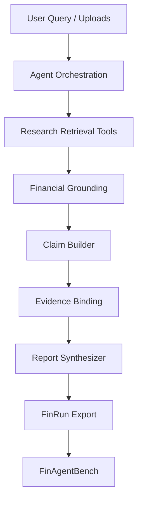

# LumenFin Final Architecture

Trustworthy Financial Research Agent — architecture for **portfolio release
candidate** `0.1.0rc2` (FinRun schema `1.0`, FinAgentBench pin `v0.1.0-rc.1`).

LumenFin is a portfolio release candidate validated under controlled
multi-process and deterministic fault-injection conditions. These results
are not a certification of unrestricted production readiness.

---

## 1. System Overview

**LumenFin** is a LangGraph-orchestrated financial research agent. It turns a
user query (and optional SEC filings / uploads) into a diligence report that is
intended to be **grounded, checkable, and honest when data is missing**.

| Goal | Meaning in practice |
|------|---------------------|
| Grounded financial analysis | Numbers come from AST-safe formulas over retrieved or SEC/Yahoo fundamentals — not LLM invention |
| Evidence-backed claims | Material assertions are claim objects bound to evidence citations before synthesis |
| Reliable reports | Fail-closed (`incomplete_data`) when fundamentals are absent; issuer isolation against peer pollution |
| Operable runtime | PostgreSQL + Redis reliable queues + Milvus Server + provider resilience under multi-process stress |

**Sibling evaluator:** [FinAgentBench](https://github.com/majiali423/finagentbench-demo)
scores exported `FinRun` traces (published tag preferred; local sibling checkout
optional for offline demos). LumenFin generates; FinAgentBench gates reliability.

Canonical path:

```text
LumenFin run → export_finrun_state() → FinAgentBench (ci / regression)
```

---

## 2. Agent / evidence path

```text
Query / PDF
→ LangGraph orchestration
→ SEC / Yahoo / hybrid RAG
→ structured financial grounding
→ claim builder
→ evidence binder
→ verified-only synthesis
→ FinRun
→ FinAgentBench
```

```text
User Query (+ optional PDFs)
        ↓
Agent Orchestration (LangGraph state machine)
  input_guardrail → query_planner → (HITL clarify?) → supervisor
        ↓
Research / Retrieval / Tool Layer
  upload parse · Milvus hybrid RAG · market snapshot · tools
        ↓
Financial Grounding Layer
  issuer-only SEC / Yahoo gap-fill when uploads are not AST-computable
        ↓
Claim Builder + Evidence Binding
  claim_binder: numeric / risk / investment claims → structural verify
        ↓
Report Synthesizer (verified claims only)
        ↓
FinRun Export → FinAgentBench Evaluation
```

### Module responsibilities

| Layer | Responsibility |
|-------|----------------|
| **Agent orchestration** | Explicit LangGraph nodes with `audit_log`; conditional edges for repair, appendix replan, HITL pause |
| **Research / retrieval / tools** | PDF/HTML chunking, hybrid RAG (`filename#pN`), ticker resolve, market providers |
| **Financial grounding** | Issuer fundamentals from SEC companyfacts / Yahoo when AST coverage is incomplete |
| **Claim builder** | Typed claim objects from quant / risk / report context |
| **Evidence binding** | Structural verify; reject unbound inventable numerics under fail-closed |
| **Report synthesizer** | Markdown from verified claims + ledger; disclose limitations |
| **FinRun export** | Framework-independent evaluation artifact |
| **FinAgentBench** | Replay-first scoring; CI gate without calling the agent runtime |



---

## 3. Runtime topology

Validated multi-process reference (Phase 3.2B / 3.3A Docker):

```text
Load balancer / direct API ports
        ↓
API A / API B
        ↓
PostgreSQL
  - checkpoints
  - jobs
  - RAG documents
  - canonical chunks
  - leases / attempts
        ↓
Redis
  - pending
  - processing
  - dead-letter
        ↓
Index Worker A / B
        ↓
Milvus Server
        ↓
Provider resilience layer
  (DeepSeek / DashScope / SEC / Yahoo policies)
```

| Store | Role |
|-------|------|
| **PostgreSQL** | Checkpoints (CAS revision), jobs, RAG metadata/chunks, index leases/attempts |
| **Redis** | Reliable index/analysis queues: pending → processing → dead-letter; Lua reserve/ack/retry/reclaim |
| **Milvus Server** | Shared vector index for hybrid RAG (integration). Lite remains a local/dev option only |
| **API instances** | Stateless-ish request handlers; process-local HTTP clients and bulkheads |
| **Index workers** | Claim lease, embed, upsert vectors, finalize ready/failed with fencing |

Local demos may use SQLite + Milvus Lite under `APP_ENV=test` / explicit
`MAS_ALLOW_SQLITE_DEV`. Production/integration **require** PostgreSQL.

---

## 4. Provider reliability

Single retry owner per logical provider call (`call_with_policy`):

- Request-level deadline
- `max_attempts` = total physical attempts
- `Retry-After` honored (bounded)
- Exponential backoff + bounded jitter
- Process-local shared `httpx.Client` (`trust_env=False`)
- Fallback marked `degraded` (does not hide primary failure class)
- Per-process bulkhead (`provider_busy` is not HTTP-retried)
- Deterministic provider stub for Phase 3.3A (no live keys required)

**Note:** per-process bulkhead ≠ cross-process global rate limit.

Evidence: [PHASE33A_PROVIDER_RESILIENCE_REPORT.md](PHASE33A_PROVIDER_RESILIENCE_REPORT.md)
(`docker_20260804T100817Z`).

---

## 5. Multi-tenant boundary

Current implementation: **RAG data-plane tenant-aware logical isolation**.

Covered: tenant in document IDs, PostgreSQL filters, Redis payload, Milvus
filters, keyword/hybrid retrieval, integration leakage = 0.

Not covered: identity-bound tenants, JWT/API-key claims, full checkpoint/job
tenant scope, PostgreSQL RLS, per-tenant databases.

Details: [MULTI_TENANCY_BOUNDARY.md](MULTI_TENANCY_BOUNDARY.md).

---

## 6. Data flow (uploaded 10-K)

```text
Document (SEC 10-K PDF / HTML)
        ↓
Parsing (PyMuPDF / HTML extract)
        ↓
Indexing (chunks → PostgreSQL + Milvus; async workers in integration)
        ↓
Financial Facts (document + issuer SEC/Yahoo gap-fill)
        ↓
Retrieval (hybrid RAG + structured company payload)
        ↓
Quant / risk → Claims → Evidence binding → Report → FinRun → FinAgentBench
```

### Important separations

1. **RAG ≠ fundamentals.** Narrative cites ≠ AST-computable structured facts.
2. **Issuer ≠ peer.** Uploads expand `issuer_companies` only.
3. **Claim ≠ sentence.** Fluent text is trusted only when mapped to verified claims.
4. **Provider retry ≠ Redis job retry.** Outer job redelivery is a separate layer.

---

## 7. Related docs

| Doc | Role |
|-----|------|
| [MULTI_TENANCY_BOUNDARY.md](MULTI_TENANCY_BOUNDARY.md) | Tenant isolation scope |
| [PRODUCTION_LIMITATIONS.md](PRODUCTION_LIMITATIONS.md) | Portfolio RC positioning |
| [PHASE32B_INTEGRATION_REPORT.md](PHASE32B_INTEGRATION_REPORT.md) | Multi-process infra |
| [PHASE33A_PROVIDER_RESILIENCE_REPORT.md](PHASE33A_PROVIDER_RESILIENCE_REPORT.md) | Provider faults |
| [PORTFOLIO_RELEASE_REPORT.md](PORTFOLIO_RELEASE_REPORT.md) | Release freeze evidence |
| [FINAGENTBENCH_DESIGN.md](FINAGENTBENCH_DESIGN.md) | Evaluation design |
